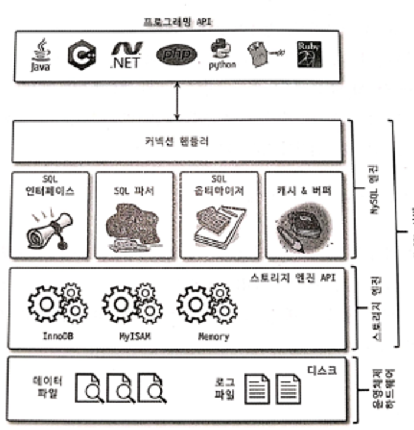
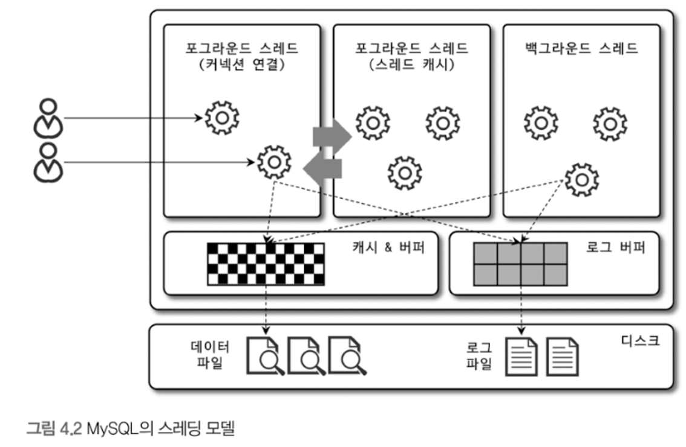
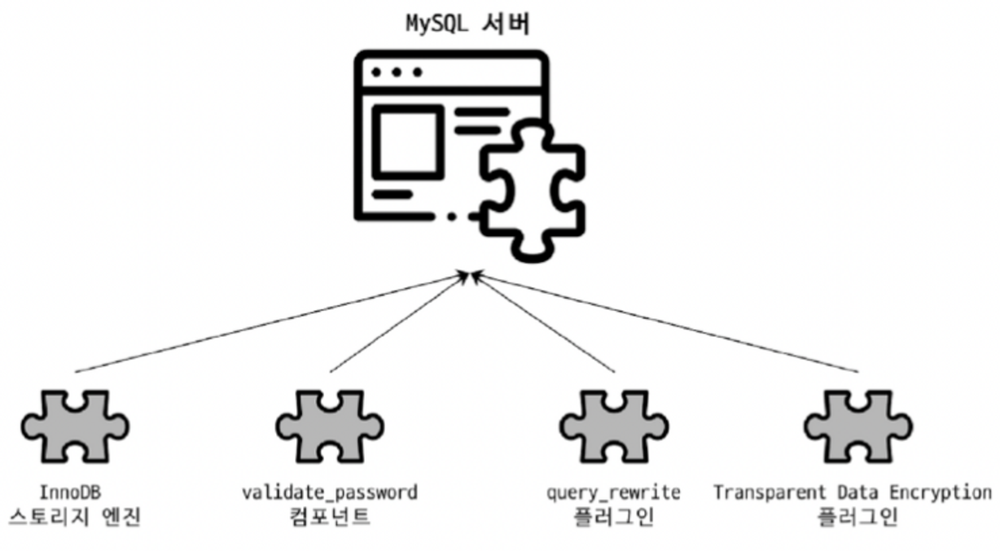
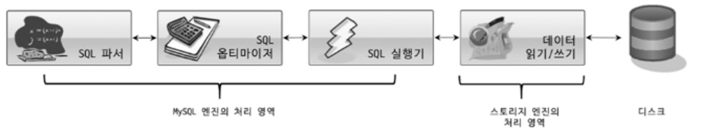
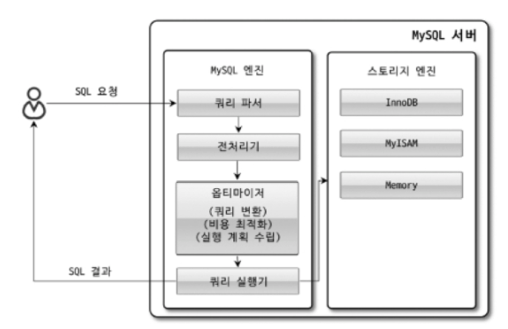

## 4.1 MySQL 엔진 아키텍처

MySQL의 쿼리를 작성하고 튜닝할 때 필요한 MySQL엔진의 구조이다

MySQL서버는 구조가 상당히 독특하다. 사용자 입장에서 보면 거의 차이가 느껴지지 않지만 이러한 독특한 구조 때문에 다른 DBMS에서 가질 수 없는 엄청난 혜택을 누릴 수 있으며 반대로 다른 DMBS에서 문제되지 않을 것들이 가끔 문제가 되기도 한다


MySQL 고유의 C API부터 JDBC, ODBC, .NET 표준 드라이버를 제공 여러 언어로 MySQL서버에서 쿼리를 사용할 수 있게 해준다

MySQL 서버는 크게 MySQL 엔진과 스토리지 엔진으로 구분하고 이 둘을 모두 합쳐서 MySQL또는 MySQL서버라고 표현

### 4.1.1.1 MySQL 엔진

클라이언트로부터의 접속 및 쿼리 요청을 담당하는 커넥션 핸들러, SQL 파서 및 전처리기, 쿼리의 최적화된 실행을 위한 옵티마이저가 주요요소, MySQL은 표준 SQL(ANSI SQL)문법을 지원하기 떄문에 표준 문법에 따라 작성된 쿼리는 타 DBMS와 호환되어 실행될 수 있다

### 4.1.1.2 스토리지 엔진

MySQL엔진은 요청된 SQL문장을 분석하거나 최적화하는 등 DMBS에 두뇌에 해당하는 처리를 수행, 실제 데이터를 디스크에 저장하거나 디스크로부터 데이터를 읽어오는 부분은 스토리지 엔진이 전담한다

MySQL 서버에서 MySQL엔진은 하나지만 스토리지 엔진은 여러개를 동시에 사용할 수 있다.

```sql
CREATE TABLE test_table (fd1 INT, fd2 INT) ENGINE=INNODB;
```

이렇게 하면 테이블이 사용할 스토리지 엔진을 지정하고 해당 테이블의 모든 읽기 작업이나 변경 작업은 정의된 스토리지 엔진이 처리한다

test_table은 innoDB스토리지 엔진을 사용하고 CRUD등의 작업이 발생하면 innoDB스토리지 엔진이 그러한 처리를 담당한다 각 스토리지 엔진은 성능 향상을 위해 키 캐시(MyISAM)이나 InnoDB 버퍼 풀과 같은 기능을 내장

나의 데이터베이스 기본 엔진을 알고싶으면

```sql
SHOW TABLE STATUS FROM jusunking
```

### 4.1.1.3 핸들러 API

MySQL 엔진의 쿼리 실행기에서 데이터를 쓰거나 읽어야 할 떄는 각 스토리지 엔진에 쓰기 또는 읽기를 요청하는데 이러한 요청을 핸들러 요청이라 하고 여기서 사용되는 API를 핸들러 API라고 함

InnoDB 스토리지 엔진 또한 이 핸들러 API를 이용해 MySQL엔진과 데이터를 주고 받는다 이 핸들러 API를 통해 얼마나 많은 데이터 작업이 있었는지는 아래 명령으로 확인 가능

```sql
SHOW GLOBAL STATUS LIKE ‘Handler%’;
```

### 4.1.2 MySQL 스레딩 구조

MySQL 서버는 프로세스 기반이 아닌 스레드 기반으로 작동, 크게 포그라운드 스레드와 백그라운드 스레드로 구분. MySQL 서버에서 실행중인 스레드의 목록은 performance_schema 데이터베이스의 threads 테이블을 통해 확인 가능

```sql
SELECT thread_id, name, type, processlist_user, processlist_host
FROM performance_schema.threads ORDER BY type, thread_id;
```

로 확인할 수 있다

리스트를 확인하면 thread/sql/one_connection 스레드만 실제 사용자의 요청을 처리하는 포그라운드 스레드다 백그라운드 스레드의 개수는 MySQL 서버의 설정 내용에 가변적, 동일한 이름의 스레드가 2개 이상이면 MySQL서버의 내용에 의해 여러 스레드가 동일 작업 병렬 처리하는 경우

### 4.1.2.1 포그라운드 스레드(클라이언트 스레드)

포그라운드 스레드는 최소한 MySQL서버에 접속된 클라이언트 수만큼 존재, 주로 각 클라이언트 사용자가 요청하는 쿼리 문장을 처리, 클라이언트 사용자가 작업을 마치고 커넥션을 종료하면 해당 커넥션을 담당하는 스레드는 다시 스레드 캐시로 돌아간다. 이때 이미 스레드 캐시에 일정 개수 이상의 대기중인 스레드가 있따면 스레드 캐시에 넣지 않고 스레드를 종료시켜 일정 개수의 스레드만 스레드 캐시에 존재하게 됨. 스레드 캐시에 유지할 수 있는 최대 스레드 개수는 thread_cache_size 시스템 변수로 설정

포그라운드 스레드는 데이터를 MySQL의 데이터 버퍼나 캐시로부터 가져오며, 버퍼나 캐시에 없는 경우에는 직접 디스크의 데이터나 인덱스 파일로부터 데이터를 읽어와서 작업을 처리한다 MyISAM 테이블은 디스크 쓰기 작업까지 포그라운드 스레드가 처리하지만 InnoDB테이블은 데이터 버퍼나 캐시까지만 포그라운드 스레드가 처리하고 나머지 버퍼로부터 디스크까지 기록하는 작업은 백그라운드 스레드가 처리

### 4.1.2.2 백그라운드 스레드

MyISAM경우 별로 해당사항 없음 InnoDB는 아래 작업이 백그라운드로 처리

- 인서트 버퍼를 병합하는 스레드
- 로그를 디스크로 기록하는 스레드
- InnoDB버퍼 풀의 데이터를 디스크에 기록하는 스레드
- 데이터를 버퍼로 읽어 오는 스레드
- 잠금이나 데드락을 모니터링 하는 스레드

이중에서 중요한건 로그 스레드와 버퍼의 데이터를 디스크로 내려쓰는 작업을 처리하는 쓰기 스레드 이다

MySQL 5.5부터 데이터 쓰기 스레드와 데이터 읽기 스레드의 개수를 2개 이상 지정할 수 있게 됐으며 innodb_write_io_threads, innodb_read_io_threads 시스템 변수로 스레드 개수를 설정한다

InnoDB에[서도 데이터를 읽는 작업은 주로 클라이언트 스레드에서 처리되기 떄문에 읽기 스레드는 많이 설정할 필요가 없지만 쓰기 스레드는 아주 많은 작업을 백그라운드로 처리하기 때문에 일반적인 내장 디스크를 사용할 떄는 2~4정도 DAS SAN 같은 스토리지를 사용할 떄는디스크를 최적으로 사용할 수 있을만큼 충분하게 설정하자

참고:

- DAS(Direct Attached Storage): DAS는 서버에 직접 연결된 스토리지를 의미합니다. 스토리지 디바이스가 서버와 직접 연결되어 있고, 해당 서버에서만 스토리지에 접근할 수 있습니다. 설치와 설정이 비교적 간단하며, 비용이 낮습니다.네트워크를 경유하지 않기 때문에 데이터 전송 속도가 빠를 수 있습니다. 확장성이 제한적이고 여러 서버간의 스토리지 공유가 어렵다
- SAN(Storage Area Network): 은 고속 네트워크를 통해 여러 서버가 공유할 수 있는 중앙 집중식 스토리지를 의미합니다. SAN은 네트워크를 통해 여러 서버가 스토리지에 접근할 수 있는 구조입니다 확장성이 높고, 스토리지를 중앙 집중적으로 관리할 수 있습니다.여러 서버 간에 데이터를 공유하고, 고가용성을 제공할 수 있습니다. 고속 네트워크를 사용하기 때문에 대규모 데이터 전송에 유리합니다. 설치와 유지 관리가 복잡하고 비용이 높습니다. 네트워크의 성능에 따라 데이터 전송 속도가 좌우될 수 있습니다.

사용자의 요청을 처리하는 도중 데이터의 쓰기 작업은 지연되어 처리될 수 있지만 데이터의 읽기 작업은 절대 지연될 수 없다. 그래서 일반적인 DBMS는 대부분 쓰기 작업을 버퍼링 해서 일괄 처리하는 기능이 탑재되어 있고, InnoDB또한 이러한 방식으로 처리한다. 하지만 MyISAM은 그렇지 않고 사용자 스레드가 쓰기 작업까지 함께 처리하도록 설계돼 있다. 이러한 이유로 InnoDB 에서는 insert update delete 쿼리로 데이터가 변경되는 경우 데이터가 디스크의 데이터 파일로 완전히 저장될 때 까지 기다릴 필요 없다 하지만 MyISAM에서 일반적인 쿼리는 쓰기 버퍼링 기능을 사용할 수 없다

쓰기 작업이란?

데이터베이스에서 쓰기 작업은 데이터를 디스크에 저장하는 과정입니다. 여기에는 새로운 데이터를 추가하거나 기존 데이터를 수정하는 작업이 포함됩니다. 디스크는 상대적으로 느리기 때문에, 쓰기 작업이 디스크에 직접 수행되면 성능이 크게 저하될 수 있습니다.

**버퍼 메모리 사용**: 쓰기 작업이 발생하면, 데이터베이스 시스템은 이를 즉시 디스크에 기록하지 않고 먼저 메모리 내의 특정 공간(버퍼)에 저장합니다. 이 버퍼는 데이터를 임시로 보관하기 위한 메모리 영역입니다.

**일괄 처리**: 버퍼에 충분한 양의 데이터가 쌓이거나 일정 시간이 지나면, 데이터베이스 시스템은 이 데이터를 한 번에 디스크에 기록합니다. 이를 "일괄 처리(batching)"라고 합니다. 이렇게 하면 디스크 I/O 작업의 빈도를 줄이고, 각 작업당 쓰기 작업의 효율성을 높일 수 있습니다.

**효율성 향상**: 버퍼링을 통해 여러 개의 작은 쓰기 작업을 하나의 큰 쓰기 작업으로 병합함으로써, 디스크에 대한 쓰기 작업의 빈도를 줄이고 성능을 크게 향상시킬 수 있습니다. 이 방식은 특히 랜덤한 작은 쓰기 작업이 빈번한 워크로드에서 매우 유용합니다.

그럼 데이터 일관성은?

데이터베이스 시스템은 쓰기 작업이 버퍼링되는 동안에도 일관성을 유지할 수 있도록 트랜잭션 관리 및 로그 기능을 사용합니다. 만약 시스템이 비정상적으로 종료되더라도, 버퍼에 있는 데이터가 손실되지 않도록 복구할 수 있는 메커니즘이 존재합니다.

### 4.1.3 메모리 할당 및 사용 구조

MySQL에서 사용되는 메모리 공간은 크게 글로벌 메모리 공간과 로컬 메모리 공간으로 구분할 수 있다

### 4.1.3.1 글로벌 메모리 영역

MySQL 서버가 시작되면서 시스템 변수로 설정한 만큼 OS로부터 메모리가 할당됨.

일반적으로 클라이언트 스레드 수와 무관하게 하나의 메모리 공간만 할당됨. 단 필요에 따라 2개 이상의 메모리 공간을 할당받을 수 있지만 클라이언트의 스레드 수와는 무관, 생성된 글로벌 영역이 N개라 해도 모든 스레드에 의해 공유

- 테이블 캐시
- InnoDB 버퍼 풀
- InnoDB 어댑티브 해시 인덱스
- InnoDB 리두 로그 버퍼

### 4.1.3.2 로컬 메모리 영역

세션 메모리 영역이라고도 불리며 MySQL서버상에 존재하는 클라이언트 스레드가 쿼리를 처리하는 데 사용하는 메모리 영역 커넥션 버퍼와 정력 버퍼 등이 있다.

클라이언트가 MySQL서버에 접속하면 MySQL서버에서는 클라이언트 커넥션으로부터 요청을 처리하기 위해 스레드를 하나씩 할당하게 되는데 클라이언트 스레드가 사용하는 메모리 공간이라고 해서 클라이언트 메모리 영역이라고 한다.

로컬 메모리는 각 클라이언트 스레드별로 독립적으로 할당되며 절대 공유되어 사용되지 않는다는 특징이 있다. 글로벌 메모리 영역의 크기는 주의해서 설정함지만 소트 버퍼와 같은 로컬 메모리 영역은 크게 신경쓰지 않고 설정하는데 최악의 경우, MySQL서버가 메모리 부족으로 멈추버릴 수 있으며 적절한 메모리 공간을 설정하는 것이 중요하다.

또다른 특징은 각 쿼리의 용도별로 필요할 때만 공간이 할당되고 필요하지 않은 경우에는 MySQL이 메모리 공간을 할당조차도 하지 않을 수 있다(ex 소트 버퍼, 조인 버퍼) 그리고 로컬 메모리 공간은 커넥션이 열려 있는 동안 계속 할당된 상태로 남아있는 공간(커넥션 버퍼, 결과 버퍼)도 있고 쿼리를 실행하는 순간에만 할당했다가 다시 해제하는 공간(소트 버퍼, 조인 버퍼)가 있다

- 정렬 버퍼
- 조인 버퍼
- 바이너리 로그 캐시
- 네트워크 버퍼

### 4.1.4 플러그인 스토리지 엔진 모델

플러그인에서 사용할 수 잇는 것이 스토리지 엔진만 있는게 아니다. 전문 검색 엔진을 위한 검색어 파서(인덱싱할 키워드를 분리해내는 작업)도 플러그인 형태로 개발해서 사용할 수 있다 기본적인 스토리지 엔진 말고 부가적인 기능을 제공하는 스토리지 엔진을 직접 개발하는 것도 가능

MySQL에서 쿼리가 실행되는 과정을 크게

이렇게 나눌 수 있는데 대부분의 작업이 MySQL 엔진에서 처리되고 마지막 데이터 읽기 쓰기 작업만 스토리지 엔진에 의해 처리된다 만약 사용자가 새로운 용도의 스토리지 엔진을 만든다 해도 RDMS전체 기능이 아닌 일부분의 기능만 수행하는 엔진을 작성하게 된다는 의미

데이터 읽기 쓰기 작업은 대부분 1건의 레코드 단위(ex 특정 인덱스의 레코드 1건 읽기 또는 마지막으로 읽은 레코드의 다음 또는 이전 레코드 읽기)로 처리된다 그리고 MySQL을 사용하다 보면 핸들러 라는 단어를 많이 접하는데 핸들러는 자동차로 비유해 보면 운전대로 자동차를 운전하듯이 프로그래밍 언어에서는 어떤 기능을 호출하기 위해 사용하는 운전대와 같은 역할을 하는 객체를 핸들러 라고 한다. MySQL서버에서 MySQL엔진은 사람 역할을 하고 각 스토리지 엔진은 자동차 역할을 하는데 MySQL엔진이 스토리지 엔진을 조정하기 위해 핸들러 라는 것을 사용한다

MySQL에서 핸들러는 개념만 간단하게 이해해도 되는데 MySQL엔진이 각 스토리지 엔진에게 데이터를 읽어오거나 저장하도록 명령하려면 반드시 핸들러를 통해야 하나는 점만 기억하자

group by나 order by 등 복잡한 처리는 스토리지 엔진 영역이 아니라 MySQL엔진의 처리영역인 ‘쿼리 실행기’ 에서 처리한다

MyISAM이나 InnoDB같이 엔진의 차이는 스토리지 엔진의 처리 영역에서만 차이점이 있다. 그럼 별 차이가 없네? ㄴㄴ 데이터 읽기 쓰기 처리 방식이 엄청 달라질 수 잇다

중요한 내용은 하나의 쿼리 작업은 여러 하위 작업으로 나뉘는데 각 하위 작업이 MySQL엔진 영역에서 처리되는지 아니면 스토리지 엔진 영역에서처리 되는지 구분할 수 있어야 함

### 4.1.5 컴포넌트

MySQL 8.0 부터 기존의 플러그인 아키텍처를 대체하기 위해 컴포넌트 아키텍처가 지원된다. MySQL서버의 플러그인의 단점은

- 플러그인은 오직 MySQL서버와 인터페이스 할 수 있고 플러그인끼리 통신 불가
- 플러그인은 MySQL 서버의 변수는 함수를 직접 호출하기 떄문에 안전하지 않음
- 플러그인은 상호 의존 관계를 설정할 수 없어서 초기화 어려움

의 단점을 해결하기 위해 컴포넌트 아키텍처가 나왔다

플러그인과 마찬가지로 컴포넌트도 설치하면서 새로운 시스템 변수를 설정해야 할 수도 있으니 컴포넌트를 사용하기 전에 관련 매뉴얼을 봐라

### 4.1.6 쿼리 실행 구조

쿼리를 실행하는 관점에서 MySQL의 구조를 간략하게 그림으로 표현했다

### 4.1.6.1 쿼리 파서

쿼리 파서는 사용자 요청으로 들어온 쿼리 문장을 토큰(MySQL이 인식할 수 잇는 최소 단위의 어휘나 기호)으로 분리해 트리 형태의 구조로 만들어 내는 작업을 의미한다 쿼리 문장의 기본 문법 오류는 이 과정에서 발견되고 사용자에게 오류 메시지를 전달하게 된다

### 4.1.6.2 전처리기

파서 과정에서 만들어진 파서 트리를 기반으로 쿼리 문장에 구조적인 문제점이 잇는지 확인한다. 각 토큰을 테이블 이름이나 칼럼 이름, 또는 내장 함우와 같은 개체를 매핑해 해당 객체의 존재 여부와 객체의 접근 권한 등을 확인하는 과정을 이 단계에서 수행한다. 실제 존재하지 않거나 권한상 사용할 수 없는 개체의 토큰은 이 단계에서 걸러진다

### 4.1.6.3 옵티마이저

옵티마이저랑 사용자의 요청을 ㅗ들어온 쿼리 문장을 저렴한 비용으로 가장 빠르게 처리할지를 결정하는 역할을 담당하며, DBMS의 두뇌에 해당한다고 볼 수 있다. 대부분의 옵티마이저가 선택하는 내용을 설명할것이며 어떻게 하면 옵티마이저가 더 나은 선택을 할 수 있게 유도하는가를 알려 줄 것이다. 그만큼 옵티마이저의 역할을 중요하고 영향 범위 또한 아주 넓다

### 4.1.6.4 실행 엔진

옵티마이저가 두뇌라면 실행 엔진과 핸들러는 손과 발에 비유할 수 있다. 만약에 옵티마이저가 GROUP BY를 처리하기 위해 임시 테이블을 사용하기로 결정했다고 해보면

1. 실행 엔진이 핸들러에게 임시 테이블을 만들어달라고 요청
2. 다시 실행 엔진은 WHERE절에 일치하는 레코드를 읽어오라고 핸들러에게 요청
3. 읽어온 레코드들을 1번에서 준비한 임시 테이블로 저장하라고 다시 핸들러에게 요청
4. 데이터가 준비된 임시 테이블에서 필요한 방식으로 데이터를 읽어 오라고 핸들러에게 다시 요청
5. 최종적으로 실행 엔진은 결과를 사용자나 다른 모듈로 넘김

실행 엔진은 만들어진 계획대로 각 핸들러에게 요청해서 받은 결과를 또 다른 핸들러 요청의 입력으로 연결하는 역할을 수행

### 4.1.6.5 핸들러(스토리지 엔진)

MySQL 서버의 가장 밑단에서 MySQL실행 엔진의 요청에 따라 데이터를 디스크로 저장하고 디스크로부터 읽어오는 역할을 담당한다. 핸들러는 결국 스토리지 엔진을 의미하며, MyISAM테이블을 조작하는 경우에는 핸들러가 MyISAM 스토리지 엔진이 되고, InnoDB 테이블을 조작하는 경우에는 핸들러가 InnoDB스토리지 엔진이 된다

### 4.1.6.6 복제

MySQL서버에서 복제는 매우 중요한 역할을 담당한다 나중에 다룬다고 한다 근데 이거 master slave 구조에서 사용했던거같은데 재밋을거같다

### 4.1.8 쿼리 캐시

MySQL 서버에서 쿼리 캐시는 빠른 응답을 필요로 하는 웹 기반의 응용 프로그램에서 매주 중요한 역할을 한다 쿼리 캐시는 SQL실행 결과를 메모리에 캐시하고 동일 SQL쿼리가 실행되면 테이블을 읽지 않고 즉시 결과를 반환하기 떄문에 매우 빠른 성능을 보였다 하지만 쿼리 캐시는 테이블의 데이터가 변경되면 캐시에 저장된 결과중에서 변경된 테이블과 관련된 것들은 모두 삭제해야 했다 이는 심각한 동시 처리 성능 저하를 유발한다. 또한 MySQL서버가 발전하면서 성능이 개선되는 과정에서 쿼리 캐시는 계속된 동시 처리 성능 저하와 많은 버그의 원인이 되기도 한다

### 4.1.9 스레드 풀

스레드 풀은 자바, 스프링에도 있으니 개념 설명은 생략 (노드는 없나?)

MySQL 서버 엔터프라이즈 에디션은 스레드풀 기능을 제공하지만 MySQL커뮤니티 에디션은 스레드 풀 기능을 지원하지 않는다.

우선 MySQL 엔터프라이즈 스레드 풀 기능은 MySQL 서버 프로그램에 내장돼 있지만 Percona server의 스레드 풀은 플러그인 형태로 작동하게 구현돼 있다는 차이점이 있다. 만약에 커뮤니티에서 쓰고싶으면 percona serer에서 스레프 풀 플러그인 라이브러리를 설치하면 된다

스레드 풀은 내부적으로 사용자의 요청을 처리하는 스레드 개수를 줄여서 동시 처리되는 요청이 많다 하더라도 MySQL서버의 CPU가 제한된 개수의 스레드 처리에만 집중할 수 있게 해서 서버의 자워 소모를 줄이는 것이 목적이다

하지만 마냥 스레드 풀 설치한다고 해서 성능이 좋아지는게 아니다 왜? 스케줄링 과정에서 CPU시간을 제대로 확보하지 못하는 경우에는 쿼리 처리가 더 느려지는 사례도 발생할 수 있따 하지만 적절하게 제한된 수의 스레드(CPU코어 수와 맞추는)만으로 CPU가 처리하게 한다면 운영체제 입장에서는 불필요한 컨텍스트 스위치를 줄여서 오버헤드를 낮출 수 있다

### 4.1.10 트랜잭션 지원 메타데이타

데이터베이스 서버에서 테이블의 구조 정보와 스토어드 프로그램(일련의 SQL 문을 하나의 단위로 실행할 수 있게 하는 코드 블록입니다. 특정 작업을 수행하기 위해 여러 SQL 문을 묶어 두고, 필요할 때 호출해서 실행) 등의 정보를 데이터 딕셔너리 또는 메타데이터라고한다

5.7버전까지 테이블의 구조를 FRM 파일에 저장하고 일부 스토어드 프로그램 또한 파일 기반으로 관리했는데 이렇게 만든 메타데이터는 생성 변경 작업이 트랜잭션을 지원하지 않아서 테비을 생성 변경동안 MySQL 서버가 비정상적으로 종료되면 정합성이 꺠졌자 이 현상을 데이터베이스 or 테이블이 깨졌다 라고 표현

MySQL 8.0버전부터는 테이블의 구조정보나 스토어드 프로그램의 코드 관련 정보를 모두 InnoDB의 테이블에 저장하게 개선됬다 MySQL서버가 작동하는데 기본적으로 필요한 테이블들을 묶어서 시스템 테이블이라고 하는데 대표적으로 사용자의 인증과 권한에 관련된 테이블들이 있다

데이터 딕셔너리와 시스템 테이블이 모두 트랜잭션 기반의 InnoDB 스토리지에 저장되어서 스키마 변경작업 중간에 비정상 종료된다 해도 정합성을 유지할 수 있다. 하지만 MyISAM이나 CSV등과 같은 스토리지 엔진의 메나정보는 여전히 저장할 공간이 필요하다 InnoDB외에 스토리지 엔진에서는 SDI 파일을 사용한다