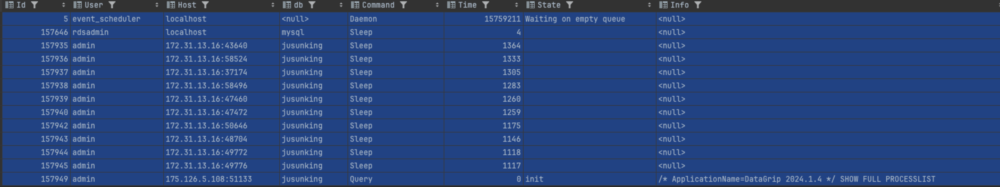

## 5.1 트랜잭션

트랜잭션이란 무엇인가

데이터베이스의 상태를 변화시키기 위해서 수행하는 작업의 단위를 뜻한다

트랜잭션의 작업은 완전성을 보낭해준다 논리적인 작업 셋을 모두 완벽하게 처리하거나, 처리하지 못할 경우에는 원 상태로 복구해서 작업의 일부만 적용되지 않게 하는 것이다

InnoDB에서는 트랜잭션을 지원하고 MyISAM이나 MEMORY같은 스토리지 엔진은 트랜잭션을 지원하지 않는다

### 5.1.1 MySQL에서의 트랜잭션

꼭 여러개의 변경 작업을 수행하는 쿼리가 조합됐을 때만 의미 있는 개념은 아니다. 트랜잭션은 하나의 논리적인 자겅ㅂ 셋에 하나의 쿼리가 있든 두개 이상의 쿼리가 있든 관계없이 논리적인 작업 셋 자체가 100퍼센트 적용되거나 아무것도 적용되지 않음을 보장해주는 것이다

이미 3번 pk가 있는 테이블에다가

INSERT INTO table (fdpk) VALUES (1), (2), (3);

쿼리를 실행시키면 3번을 pk중복으로 오류가 발생할 것이다. InnoDB에서는 이미 존재했던 3번만 남아 있고 MyISAM은 1, 2, 3 이 전부 다 커밋된걸 볼 수 있다 이는 부분 업데이트 라는 문제라고 표현하며, 데이터의 정합성을 맞추는데 어려운 문제를 발생시킨다

### 5.1.2 주의사항

트랜잭션 또한 DBMS의 커넥션과 동일하게 꼭 필요한 최소의 코드에만 적용하는 것이 좋다. 이는 프로그램 코드에서 트랜잭션 범위를 최소화하라는 의미이다. 게시판에 게시글을 작성하고 저장 버튼을 클릭하는 기능이라고 가정하면

1. 처리 시작
2. 데이터베이스 커넥션 생성, 트랜잭션 시작
3. 사용자의 로그인 여부 확인
4. 사용자의 글쓰기 내용의 오류 여부 확인
5. 첨부로 업로드된 파일 확인 및 저장
6. 사용자의 입력 내용을 DBMS에 저장
7. 첨부 파일 정보를 DMBS에 저장
8. 저장된 내용 또는 기타 정보를 DBMS에서 조회
9. 게시글 등록에 대한 알림 메일 발송
10. 알림 메일 발송 이력을 DBMS에 저장
11. 트랜잭션 종료, 커넥션 반납
12. 처리 완료

이 절차 중 DBMS 트랜잭션 처리에 좋지 않은 영향을 미치는 부분을 봐보자

1. 실제로 DBMS에 저장되는건 6번부터다 그래서 3, 4, 5는 트랜잭션에 포함하지 않아도 된다 왜 와이? 커넥션 개수가 제한적이여서 각 단위 프로그램이 커넥션을 소유하는 기간이 길어질수록 사용 가능한 여유 커넥션 개수는 줄어들고 어느순간부터는 커넥션을 기다려야 하는 스레드가 생길 수 있다.
2. 10번 작업은 알림 메일을 발송하는 것인데. FTP파일전송이나 네트워크를 통해 서버와 통신하는 작업은 DBMS트랜잭션에서 제외시키는게 좋다. 메일 서버에서 오류가 생기면 우리 서버도 위험해 지기 떄문이다
3. 6, 7번은 반드시 하나의 트랜잭션으로 묶어야 하며, 8번은 단순 조회이므로 트랜잭션에 포함시키지 않아도 된다. 그리고 10번 작업은 6, 7번과 성격이 다르므로 별도의 트랜잭션으로 분리하는게 좋다

개선 결과:

1. 처리 시작
2. 사용자의 로그인 여부 확인
3. 사용자의 글쓰기 내용의 오류 여부 확인
4. 첨부로 업로드된 파일 확인 및 저장
5. 데이터베이스 커넥션 생성, 트랜잭션 시작
6. 사용자의 입력 내용을 DBMS에 저장
7. 첨부 파일 정보를 DMBS에 저장
8. 트랜잭션 종료
9. 저장된 내용 또는 기타 정보를 DBMS에서 조회
10. 게시글 등록에 대한 알림 메일 발송
11. 트랜잭션 시작
12. 알림 메일 발송 이력을 DBMS에 저장
13. 트랜잭션 종료, 커넥션 반납
14. 처리 완료

결론은 프로그램의 코드가 데이터베이스 커넥션을 가지고 있는 범위와 트랜잭션이 활성화돼 있느 ㄴ프로그램의 범위를 최소화해야 한다는 것이다.또한 네트워크 작업이 있는 경우에는 반드시 트랜잭션에서 배제 해야 한다.

## 5.2 MySQL엔진의 잠금

MySQL에서 사용되는 잠금은 크게 스토리지 엔진 레벨과 MySQL엔진 레벨로 나눌 수 있다 MySQL엔진은 MySQL 서버에서 스토리지 엔진을 제외한 나머지 부분으로 이해하면 되는데 MySQL엔진 레벨의 잠금은 모든 스토리지 엔진에 영향을 미치지만 스토리지 엔진 레벨의 잠금은 스토리지 엔긴 간 상호 영향을 미치지 않는다

MySQLㅇ렌진에서는 테이블 데이터 동기화를 위한 테이블 락 이외에도 테이블의 구조를 잠그는 메타데이터 락, 그리고 사용자의 필요에 맞게 사용할 수 있는 네임드 락이라는 잠금 기능도 제공한다

### 5.2.1 글로벌 락

글로벌 락은 MySQL에서 제공하는 잠금 가운데 가장 범위가 크다. 한 세션에서 글로벌 락을 획득하면 다른 세션에서 SELECT를 제외한 모든 DDL, DML문장을 싱행하는 경우 글로벌 락이 해제될 때까지 해당 문장이 대기 상태로 남는다.

백업 락은 백업이 실행중에 스키마 변경이 실행되면 백업은 실패한다. 그럼 다시 백업 시작해야된다 백업 락은 이런 목적으로 도입됬으며, 정상적으로 ㅍ복제는 실행되지만 백업의 실패를 막기 위해 DDL명령이 실행되면 복제를 일시 중지하는 역할을 한다

### 5.2.2 테이블 락

테이블 락은 개별 테이블 단위로 설정되는 잠금이며, 명시적 혹은 묵시적으로 특정 테이블의 락을 획득할 수 있다. LOCK TABLES table_name [READ | WRITE]

로 락을 걸고 UNLOCK 으로 락을 해제할 수 있다. 명시적인 테이블 락은 특별항 상황이 아니면 어플리케이션에서 사용할 필요가 거의 없긴하다. 명시적인 테이블 작업은 성능적으로 상당한 영향을 미치기 떄문이다.

묵시적인 테이블 락은 테이블의 데이터를 변경하는 쿼리를 실행할 때, 자동으로 획득되고 쿼리가 완료되면 자동 해제된다. InnoDB경우 스토리지 엔진 차원에서 레코드 기반 잠금을 제공하기 때문에 단순 데이터 변경 쿼리로 인해 묵시적인 테이블 락이 설정되지는 않는다. 더 정확히는 테이블 락이 설정되지만 DML쿼리에서는 무시되고 DDL의 경우에만 영향을 미친다

### 5.2.3 네임드 락

네임드락은 GET_LOCK함수를 이용해 임의의 문자열에 잠금을 설정할 수 있다. 대상이 테이블이나 레코드 또는 AUTO_INCREMENT와 같은 데이터베이스 객체가 아니라는 것이다. 단순히 사용자가 지정한 문자열에 대해 획득하고 반납하는 잠금이다. 네임드 락은 자주 사용되지는 않는다. 예를들어 데이터베이스 서버1대의 5개의 웹 서버가 접속해서 서비스 하는 상황에 5대의 웹 서버가 어떤 정보를 동기화해야 하는 요건처럼 여러 클라이언트가 상호 동기화를 처리해야 할 때 네임드 락을 이용하면 쉽게 해결할 수 있다.

```sql
SELECT GET_LOCK('mylock' 2); -> mylock이라는 문자열에 대해 잠금을 획득
이미 잠금을 사용중이라면 2초동안만 대기, 2초 이후 잠금 해제

SLECT IS_FREE_LOCK('mylock'); -> mylock이라는 묹열에 잠금이 설정돼있는지 확인

SELECT RELEASE_LOCK('mylock'); -> mylock이라는 문자열에 대해 획득했던 잠금을 해제
```

네임드 락은 많은 레코드에 대해서 복잡한 요건으로 레코드를 변경하는 트랜잭션에 유용하게 사용할 수 있다

배치 프로그램처럼 한꺼번에 많은 레코드를 변경하는 쿼리는 자주 데드락의 원인이 된다. 이런 경우 동이 ㄹ데이터를 변경하거나 참조하는 프로그램끼리 분류해서 네임드 락을 걸고 쿼리를 실행하면 아주 간단하게 해결할 수 있다.

### 5.2.4 메타데이터 락

메타데이터 락은 데이터베이스 객체의 이름이나 구조를 변경하는 경우 획득하는 잠금이다. 메타데이터 락은 명시적으로 획득하거나 해제할 수 있는 것이 아니고 RENAME TABLE tab_a TO tab_b 와 같이 테이블의 이름을 변경하는 경우 자동으로 획득하는 잠금이다 이런 경우 원본 테이블과 변경될 테이블 이름 두개 모두 한꺼번에 잠금을 설정한다.

만약에 배치 프로그램에서 실시간으로 테이블을 바꿔야 한다고 가정해보자

```sql
// 랭킹 배치가 완료되면 현재 서비스용 rank를 rank_backup으로 백업하고
// 새로만들어진 rank_new를 서비스용 rank로 변경하고자 하는 경우
RENAME TABLE rank TO rank_backup, rank_new TO rank;

```

이렇게 쿼리를 짜면 실제 어플리케이션에선 Table Not Found “rank” 와 같은 에러를 발생시키지 않고 적용하는게 가능하다

몰랐는데 어떤 테이블의 구조를 변경해야 할 때는 Oneline DDL(DDL 작업 중에도 DML작업이 가능하게 해주는)을 이용하여 변경할 수 있지만 시간이 너무 오래 걸리는 경우 언두로그 증가와 누적된 Oneline DDL버퍼 크기가 문제이다.

이때는 새로운 테이블 구조를 먼저 생성하고 pk키 id값을 범위별로 나눠서 여러개의 스레드로 빠르게 복사한다

```sql
CREATE TABLE access_log_new(
	...
) KEY_BLOCK_SIZE=4; -> 테이블의 압축 적용

INSERT INTO access_log_new SELECT * FROM access_log WHERE id>=0 AND id<10000;
INSERT INTO access_log_new SELECT * FROM access_log WHERE id>=10000 AND id<20000;
```

## 5.3 InnoDB 스토리지 엔진 잠금

InnoDB스토리지 엔진은 MySQL에서 제공하는 잠금과는 별개로 스토리지 엔진 내부에 레코드 기반 잠금 방식이 존재한다. 그래서 다른 엔진보다 훨씬 뛰어난 동시성 처리를 제공할 수 있다.

그리고 InnoDB에서 잠금, 잠금 대기중인 트랜잭션의 목록을 조회할 수 있는 방법이 도입됬다. MySQL서버의 information_shema 데이터베이스에 존재하는 INNODB_TRX, INNODB_LOCKS, INNODB_LOCK_WAIT 라는 테이블을 조인해서 조회하면 현재 어떤 트랜잭션이 잠금을 대기하고 있고 해당 잠금을 어떤 트랜잭션이 가지고 있는지 확인할 수 있으며 또한 장시간 잠금을 가지고 있는 클라이언트를 찾아서 종료시킬 수 있다.

하지만 시도해보니까

42S02][1109] Unknown table 'INNODB_LOCK_WAITS' in information_schema

이런 에러가 뜬다

MySQL 버전 또는 설정에 따라 `INNODB_LOCK_WAITS` 테이블이 없거나 다른 방식으로 잠금 정보를 조회해야 할 수 있음을 의미합니다. 라고 한다

```sql
SHOW ENGINE INNODB STATUS;
```

해당명령어로 돌리면 정보들이 나온다

```sql
=====================================
2024-08-17 03:50:58 22569378891520 INNODB MONITOR OUTPUT
=====================================
Per second averages calculated from the last 21 seconds
-----------------
BACKGROUND THREAD
-----------------
srv_master_thread loops: 109436 srv_active, 0 srv_shutdown, 15639522 srv_idle
srv_master_thread log flush and writes: 0
----------
SEMAPHORES
----------
OS WAIT ARRAY INFO: reservation count 36831
OS WAIT ARRAY INFO: signal count 36087
RW-shared spins 0, rounds 0, OS waits 0
RW-excl spins 0, rounds 0, OS waits 0
RW-sx spins 0, rounds 0, OS waits 0
Spin rounds per wait: 0.00 RW-shared, 0.00 RW-excl, 0.00 RW-sx
------------------------
LATEST FOREIGN KEY ERROR
------------------------
2024-08-07 12:36:48 22569218455296 Transaction:
TRANSACTION 450032, ACTIVE 0 sec updating or deleting
mysql tables in use 1, locked 1
4 lock struct(s), heap size 1128, 2 row lock(s), undo log entries 1
MySQL thread id 149728, OS thread handle 22569218455296, query id 16663529 211.48.118.208 admin updating
/* ApplicationName=DataGrip 2024.1.4 */ DELETE FROM jusunking.USER_PROFILE WHERE ID = x'2d51fc3353e511efa7760e41a5f93a78'
Foreign key constraint fails for table jusunking.USERS:
,
  CONSTRAINT FK_USERS_USER_PROFILE_ID FOREIGN KEY (USER_PROFILE_ID) REFERENCES USER_PROFILE (ID) ON UPDATE CASCADE
Trying to delete in parent table, in index PRIMARY tuple:
DATA TUPLE: 56 fields;
 0: len 16; hex 2d51fc3353e511efa7760e41a5f93a78; asc -Q 3S    v A  :x;;
 1: len 6; hex 00000006ddf0; asc       ;;
 2: len 7; hex 010000012b0d1d; asc     +  ;;
 3: len 9; hex eca095ed839cec9691; asc          ;;
 4: len 13; hex 3031302d393231302d33383032; asc 010-9210-3802;;
 5: SQL NULL;
 6: SQL NULL;
 7: SQL NULL;
 8: SQL NULL;
 9: len 10; hex 313939322d31312d3036; asc 1992-11-06;;
 10: SQL NULL;
 11: SQL NULL;
 12: len 4; hex 4d414c45; asc MALE;;
 13: SQL NULL;
 14: SQL NULL;
 15: SQL NULL;
 16: SQL NULL;
 17: SQL NULL;
 18: SQL NULL;
 19: SQL NULL;
 20: SQL NULL;
 21: SQL NULL;
 22: SQL NULL;
 23: len 4; hex 66acec68; asc f  h;;
 24: len 4; hex 66acec68; asc f  h;;
 25: len 6; hex ed839cec9691; asc       ;;
 26: len 82; hex 687474703a2f2f6b2e6b616b616f63646e2e6e65742f646e2f636843584d392f62747344774348324d30552f764e524d4f4d614176795844395752746533426647312f696d675f363430783634302e6a7067; asc http://k.kakaocdn.net/dn/chCXM9/btsDwCH2M0U/vNRMOMaAvyXD9WRte3BfG1/img_640x640.jpg;;
 27: len 19; hex 746165796a31313036406b616b616f2e636f6d; asc taeyj1106@kakao.com;;
 28: SQL NULL;
 29: SQL NULL;
 30: SQL NULL;
 31: SQL NULL;
 32: SQL NULL;
 33: SQL NULL;
 34: len 12; hex 5349474e5f55505f53544550; asc SIGN_UP_STEP;;
 35: SQL NULL;
 36: SQL NULL;
 37: SQL NULL;
 38: SQL NULL;
 39: len 4; hex 8000001f; asc     ;;
 40: SQL NULL;
 41: SQL NULL;
 42: SQL NULL;
 43: SQL NULL;
 44: SQL NULL;
 45: SQL NULL;
 46: SQL NULL;
 47: len 10; hex 4245464f52455f534554; asc BEFORE_SET;;
 48: SQL NULL;
 49: SQL NULL;
 50: SQL NULL;
 51: len 7; hex 56495349424c45; asc VISIBLE;;
 52: len 10; hex 33363438353435313537; asc 3648545157;;
 53: len 5; hex 4b414b414f; asc KAKAO;;
 54: len 0; hex ; asc ;;
 55: len 4; hex 800003f2; asc     ;;

But in child table jusunking.USERS, in index FK_USERS_USER_PROFILE_ID, there is a record:
PHYSICAL RECORD: n_fields 2; compact format; info bits 0
 0: len 16; hex 2d51fc3353e511efa7760e41a5f93a78; asc -Q 3S    v A  :x;;
 1: len 16; hex 156d901bd79c4d7ea1a927b6895d736d; asc  m    M~  '  ]sm;;

------------
TRANSACTIONS
------------
Trx id counter 464414
Purge done for trx's n:o < 464412 undo n:o < 0 state: running but idle
History list length 0
LIST OF TRANSACTIONS FOR EACH SESSION:
---TRANSACTION 304044843211312, not started
0 lock struct(s), heap size 1128, 0 row lock(s)
---TRANSACTION 304044843210504, not started
0 lock struct(s), heap size 1128, 0 row lock(s)
---TRANSACTION 304044843209696, not started
0 lock struct(s), heap size 1128, 0 row lock(s)
---TRANSACTION 304044843208888, not started
0 lock struct(s), heap size 1128, 0 row lock(s)
--------
FILE I/O
--------
I/O thread 0 state: waiting for completed aio requests ((null))
I/O thread 1 state: waiting for completed aio requests (insert buffer thread)
I/O thread 2 state: waiting for completed aio requests (read thread)
I/O thread 3 state: waiting for completed aio requests (read thread)
I/O thread 4 state: waiting for completed aio requests (read thread)
I/O thread 5 state: waiting for completed aio requests (read thread)
I/O thread 6 state: waiting for completed aio requests (write thread)
I/O thread 7 state: waiting for completed aio requests (write thread)
I/O thread 8 state: waiting for completed aio requests (write thread)
Pending normal aio reads: [0, 0, 0, 0] , aio writes: [0, 0, 0, 0] ,
 ibuf aio reads:
Pending flushes (fsync) log: 0; buffer pool: 0
2712 OS file reads, 1719425 OS file writes, 1262585 OS fsyncs
0.00 reads/s, 0 avg bytes/read, 0.00 writes/s, 0.00 fsyncs/s
-------------------------------------
INSERT BUFFER AND ADAPTIVE HASH INDEX
-------------------------------------
Ibuf: size 1, free list len 0, seg size 2, 0 merges
merged operations:
 insert 0, delete mark 0, delete 0
discarded operations:
 insert 0, delete mark 0, delete 0
Hash table size 69257, node heap has 2 buffer(s)
Hash table size 69257, node heap has 2 buffer(s)
Hash table size 69257, node heap has 3 buffer(s)
Hash table size 69257, node heap has 6 buffer(s)
Hash table size 69257, node heap has 2 buffer(s)
Hash table size 69257, node heap has 2 buffer(s)
Hash table size 69257, node heap has 2 buffer(s)
Hash table size 69257, node heap has 2 buffer(s)
0.48 hash searches/s, 0.00 non-hash searches/s
---
LOG
---
Log sequence number          225885778
Log buffer assigned up to    225885778
Log buffer completed up to   225885778
Log written up to            225885778
Log flushed up to            225885778
Added dirty pages up to      225885778
Pages flushed up to          225885778
Last checkpoint at           225885778
Log minimum file id is       5
Log maximum file id is       6
597715 log i/o's done, 0.00 log i/o's/second
----------------------
BUFFER POOL AND MEMORY
----------------------
Total large memory allocated 0
Dictionary memory allocated 978450
Buffer pool size   16383
Free buffers       11941
Database pages     4421
Old database pages 1611
Modified db pages  0
Pending reads      0
Pending writes: LRU 0, flush list 0, single page 0
Pages made young 312041, not young 13382
0.00 youngs/s, 0.00 non-youngs/s
Pages read 2531, created 3099, written 720356
0.00 reads/s, 0.00 creates/s, 0.00 writes/s
Buffer pool hit rate 1000 / 1000, young-making rate 0 / 1000 not 0 / 1000
Pages read ahead 0.00/s, evicted without access 0.00/s, Random read ahead 0.00/s
LRU len: 4421, unzip_LRU len: 0
I/O sum[2]:cur[0], unzip sum[0]:cur[0]
--------------
ROW OPERATIONS
--------------
0 queries inside InnoDB, 0 queries in queue
0 read views open inside InnoDB
Process ID=817, Main thread ID=22569365264128 , state=sleeping
Number of rows inserted 2838940, updated 59620, deleted 6787, read 1261375610
0.00 inserts/s, 0.00 updates/s, 0.00 deletes/s, 0.00 reads/s
Number of system rows inserted 16965, updated 67363, deleted 16316, read 12187758
0.00 inserts/s, 0.00 updates/s, 0.00 deletes/s, 0.57 reads/s
----------------------------
END OF INNODB MONITOR OUTPUT
============================
```

돌아가는 트랜잭션이나 대기중인 트랜잭션은 없다

### 5.3.1 InnoDB스토리지 엔진의 잠금

레코드 기반의 잠금을 제공하며 잠금 정보가 상당히 작은 공간으로 관리되기 때문에 레코드 락이 페이지 락으로 또는 테이블락으로 레벨업 되는 경우는 없다.

또한 InnoDB스토리지 엔진에서는 레코드 락 뿐만 아니라 레코드와 레코드 사이에 간격을 잠그는 갭 락이라는 것이 존재한다

### 5.3.1.1 레코드락

레코드 자체만을 잠그는 락으로 레코드 락 이라고 한다 InnoDB 스토리지 엔진은 레코드 자체가 아니라 인덱스의 레코드를 잠근다. 인덱스가 하나도 없는 테이블이라고 내부적으로 자동 생성된 클러스터 인덱스를 이용해 잠금을 설정한다.

인덱스 리프 노드

| 인덱스 키 | pk |
| --- | --- |
| kim | 1 |
| chu | 2 |
| gong | 3 |
| jo | 4 |
| joe |  |

```sql
UPDATE member SET register_date = NOW() WHERE last_name LIKE 'J%' AND first_name = 'JAEHOON';

```

UPDATE 문에 의해 영향받는 레코드는 1건이다. 하지만 1건을 업데이트 하기 위해 여러건의 인덱스 레코드에 잠금이 걸린다. 왜냐하면 MySQL은 테이블 레코드가 아닌 인덱스에 잠금을 걸기 때문이다. 인덱스는 성(last_name)으로만 구성되어 있기 때문에, 해당 레코드를 갱신하기 위해서는 인덱스를 통해 검색되는 모든 레코드에 잠금을 걸게 된다.

인덱스가 준비가 안되어있다면, 클라이언트 간의 동시성이 상당히 떨어져서 한 세션에서 update작업을 하는 중에 다른 클라이언트는 그 테이블을 업데이트 하지 못하고 기다려야 하는 상황이 발생한다 예제로 치면 조씨를 포함한 모든 곳에 락이 걸린다는 뜻이다

### 5.3.1.2 갭 락

갭 락은 레코드 자체가 아니라 레코드와 바로 인접한 레코드 사이의 간격만을 잠그는 것을 의미한다

갭락의 역할은 레코드와 레코드 사이의 간격에 새로운 레코드가 생성되는 것을 제어하는 것이다.

| id | name |
| --- | --- |
| 1 | A |
|  |  |
| 3 | B |
|  |  |
| 5 | C |

MySQL 서버에서는 이런 상태의 테이블에서 id=1인 레코드와 3인 레코드 사이의 간격과 id=3과 5 사이의 간격을 잠글 수 있다. 이렇게 실제 존재하지 않는 레코드 공간(간격)을 잠그는 것을 MySQL 서버에서는 Gap Lock이라고 한다. Gap Lock은 Primary Key뿐만 아니라 Secondary Index에도 동일하게 사용된다

### 5.3.1.3 넥스트 키 락

레코드 락과 갭 락을 합쳐놓은 잠금을 넥스트 키 락이라고 한다.

InnoDB의 갭락이나 넥스트 키 락은 바이너리 로그에 기록되는 쿼리가 레플리카 서버에 싱행될 때 소스 서버에서 만들어 낸 결과와 동일한 결과를 만들어내도록 보장하는 것이 주 목적이다 의외로 넥스크 키 락과 갭 락으로 인해 데드락이 발생하거나 다른 트랜잭션을 기다리게 만드는 일이 자주 발생한다

### 5.3.1.4 자동 증가 락

MySQL은 자동 증가하는 숫자값을 채번하기 위해 AUTO_INCREMENT라는 컬럼 속성을 제공하고, AUTO_INCREMENT가 사용된 테이블에 **동시에 여러 레코드가 insert되는 경우, 중복되지 않고 순차적으로 증가하는 일련번호 값을 가지도록 해주는데** 이때 내부적으로 테이블 수준의 잠금인 자동 증가 락 (Auto Increment Lock)을 사용한다

자동 증가 락은 **잠금을 최소화하기 위해 한 번 증가하면 절대 자동으로 줄어들지 않고 트랜잭션과도 무관하다.** 가령 **자동 증가값 채번에 성공하였지만,이후의 쿼리에서 실패하여 트랜잭션이 롤백되어도 자동 증가값은 복구되지 않고 그대로 남는다.** 만약 해당 값을 초기화하려면 아래의 쿼리를 사용해야 한다.

### 5.3.3 레코드 수준의 잠금 확인 및 해제

레코드 수누의 잠금에서는 잠금의 대상이 레코드 각각에 잠금이 걸리므로 그 레코드가 자주 사용되지 않는다면 오랜 시간 잠겨진 상태로 남아 있어 잘 발견되지 않는다

MySQL 5.1 부터 레코드 잠금과 잠금 대기에 대한 조회가 가능하므로 잠금을 대기하는 클라이언트의 정보를 확인하는 방법을 알 수 있다. 잠금을 강제로 해제하려면 KILL 명령어를 사용해서 프로세스를 강제 종료하면 된다


state를 도면 되는데 내꺼는 이제 아무런 잠금 대기가 없다 만약에 update 가 존재한다면 잠금 대기중이라서 수정 상태라고 보면 된다

KILL 16654; 하면 해당 프로세스가 강제로 종료된다

## 5.4 MySQL의 격리 수준

트랜잭션의 격리 수준이란 여러 트랜잭션이 동시에 처리될 때 특정 트랜잭션이 다른 트랜잭션에서 변경하거나 조회하는 데이터를 볼 수 있게 허용할지 말지는 결정하는 것이다.

- READ UNCOMMITTED
- READ COMMITTED
- REPEATABLE READ
- SERIALIZABLE

뒤로 갈 수록 격리정도가 높아지며 동시 처리 성능이 떨어진다

성능은 SERIALIZABLE이 성능이 많이 떨어지고 나머지는 고만고만하다 참고로 InnoDB에서는 REPEATABLE READ가 기본 디폴트 설정이다

### 5.4.1 READ UNCOMMITTED

커밋 롤백 여부와 상관없이 커밋하지 않은 데이터도 다른 트랜잭션에서 접근이 가능하다

| 사용자A | 테이블 | 사용자 B | 결과 |
| --- | --- | --- | --- |
|  | tid = 1, id = 1, name dongwoo
tid = 2, id = 2, name jihoo |  |  |
| start tx |  |  |  |
| insert into member 
(3, jaehoon) | tid = 1, id = 1, name dongwoo
tid = 2, id = 2, name jihoo
tid = 3, id = 3, name jaehoon |  |  |
|  |  | select where id = 3 | jaehoon |

트랜잭션이 완료되지 않았는데 다른 트랜잭션에서 볼 수 있는 문제를 Dirty Read라고 한다 이는 조회됬다가 사라지는 현상을 만들어서 시스템 안정성에 악영향을 미친다

| 사용자A | 테이블 | 사용자 B | 결과 |
| --- | --- | --- | --- |
|  | tid = 1, id = 1, name dongwoo
tid = 2, id = 2, name jihoo |  |  |
| start tx |  |  |  |
| insert into member (3, jaehoon) | tid = 1, id = 1, name dongwoo tid = 2, id = 2, name jihoo         tid = 3, id = 3, name jaehoon |  |  |
|  |  | select where id = 3 | jaehoon |
| roll back | tid = 1, id = 1, name dongwoo
tid = 2, id = 2, name jihoo |  |  |
|  |  | select where id = 3 | 없음 |

사용자 B입장에서는 왜 두번 조회했는데 결과가 다르지? 이게 Dirty Read이다

RDMBS 표준에서는 트랜잭션의 격리수준으로 인정하지 않을 정도로 정합성에 문제가 많은 격리 수준이다

### 5.4.2 READ COMMITTED

오라클에서 기본으로 사용하는 격리수준이며 온라인 서비스에서 가장 많이 선택되는 격리 수준이다.이 레벨에서는 Dirty read와 같은 현상은 발생하지 않는다 어떤 트랜잭션이 데이터를 변경하더라도 COMMIT이 완료된 데이터만 다른 트랜잭션에서 조회할 수 있기 때문이다

| 사용자A | 테이블 | 사용자 B | 결과 |
| --- | --- | --- | --- |
|  | tid = 1, id = 1, name dongwoo
tid = 2, id = 2, name jihoo |  |  |
| start tx |  |  |  |
| update set ‘minyeob’ 
where id = 1; | tid = 1, id = 1, name minyeob
tid = 2, id = 2, name jihoo

언두 로그
tid = 6, id 1, name dongwoo |  |  |
|  | (언두 로그에서 조회함) | select where id = 1 | dongwoo |

예를 들어 사용자 A가 트랜잭션을 시작하여 어떤 김동우 이름을 변경하였고, 아직 커밋은 하지 않은 상태이다. 그러면 테이블은 먼저 갱신되고, 언두 로그로 변경 전의 데이터가 백업된다 그리고 사용자 B가 1번 데이터를 조회하면 커밋이 되지 않았기 때문에 언두로그에서 조회한다

A가 트랜잭션을 커밋하면 그때부터 다른 트랜잭션에서 새롭게 변경된 값을 조회할 수 있게 된다

이렇게 Dirty Read는 발생하지 않지만 Non-Reapeatable Read(이하 반복읽기 불가능)은 발생하는데 알아보면

| 사용자A | 테이블 | 사용자 B | 결과 |
| --- | --- | --- | --- |
|  | tid = 1, id = 1, name dongwoo

tid = 2, id = 2, name jihoo | select where name minyeob | 결과 없음 |
| start tx |  |  |  |
| update set ‘minyeob’ where id = 1; | tid = 1, id = 1, name minyeob
tid = 2, id = 2, name jihoo

언두 로그
tid = 6, id 1, name dongwoo |  |  |
| commit | tid = 100, id = 1, name minyeob
tid = 2, id = 2, name jihoo
언두 로그
tid = 1, id 1, name dongwoo |  |  |
|  |  | select where name minyeob | 결과 존재 |

이렇게 나 말고 다른 사람의 트랜잭션 커밋 여부에 따라 결과값이 달라져버린다 이런 데이터 부정합문제를 반복 읽기 불가능 문제라고 한다

일반적인 경우에는 크게 문제가 되지 않지만, 하나의 트랜잭션에서 동일한 데이터를 여러 번 읽고 변경하는 작업이 입출금 처리와 연결되면 문제가 생길 수 있다. 예를 들어 어떤 트랜잭션에서는 오늘 입금된 총 합을 계산하고 있는데, 다른 트랜잭션에서 계속해서 입금 내역을 커밋하는 상황이라고 하자. 그러면 READ COMMITTED에서는 같은 트랜잭션일지라도 조회할 때마다 입금된 내역이 달라지므로 문제가 생길 수 있는 것이다. 따라서 격리 수준이 어떻게 동작하는지, 그리고 격리 수준에 따라 어떠한 결과가 나오는지 예측할 수 있어야 한다. 이를 위해서는 각 트랜잭션의 격리 수준이 어떻게 작동하는지 알아야 한다

### REAPEATABLE READ

바이너리 로그를 가진 MySQL에서는 기본적으로 REAPEATABLE READ수준 이상은 사용해야 한다.

InnoDB스토리지 엔진은 트랜잭션이 롤백될 가능성을 대비해 변경 전 레코드를 언두 공간에 백업해두고 실제 레코드 값을 변경한다 이런 방식을 MVCC(Multi Version Concurrency Control) 이라고 하고 한글로는 다중 버전 동시성 제어라고 한다

모든 InnoDB 트랜잭션은 고유한 트랜잭션 번호를 가지며, 각각의 트랜잭션은 순차 증가하는 고유한 트랜잭션 번호가 존재하며, 언두 영역의 백업 레코드에는 어느 트랜잭션에 의해 백업되었는지 트랜잭션 번호를 함께 저장한다. 그리고 해당 데이터가 불필요해진다고 판단하는 시점에 주기적으로 백그라운드 쓰레드를 통해 삭제한다.

REAPEATABLE READ에서는 MVCC를 보장하기 위해 실행중인 트랜잭션 가운데 가장 오래된 트랜잭션 번호보다 트랜잭션 번호가 앞선 언두 영역의 데이터는 삭제할 수 없다 그렇다고 가장 오랜된 트랜잭션 번호 이전의 트랜잭션에 의해 변경된 모든 언두 데이터가 필요한 것은 아니다.

예시를 보자

| 사용자A | 테이블 | 사용자 B | 결과 |
| --- | --- | --- | --- |
|  | tid = 1, id = 1, name dongwoo
tid = 2, id = 2, name jihoo | start tx tid = 50
select where id = 1  | dongwoo |
| start tx tid = 100 |  |  |  |
| update set ‘minyeob’ where id = 1; | tid = 100, id = 1, name minyeob
tid = 2, id = 2, name jihoo
언두 로그
tid = 1, id 1, name dongwoo |  |  |
| commit | tid = 100, id = 1, name minyeob
tid = 2, id = 2, name jihoo
언두 로그
tid = 1, id 1, name dongwoo |  |  |
|  |  | select where id = 1 | dongwoo |

어떻게 이런 방식이 가능하냐?

트랜잭션 번호를 참고하여 자신보다 먼저 실행된 트랜잭션의 데이터만을 조회한다. 만약 테이블에 자신보다 이후에 실행된 트랜잭션의 데이터가 존재한다면 언두 로그를 참고해서 데이터를 조회한다.
일단 사용자 B는 트랜잭션 50번으로 1번을 두번 조회했고 사용자 A의 트랜잭션 100번은 동우를 민엽으로 개명했다

그럼 이제 예전에 있던 동우는 tid1번으로 언두로그로 옮겨지고 개명한 민엽 트랜잭션 아이디는 100번으로 적용된다

그러면 나중에 사용자 B가 커밋 이후에 조회할때, 자기보다 트랜잭션 번호가 뒤에 있으면 무시한다 왜 나는 50번이고 트랜잭션 번호는 순차적으로 계속 올라가니까

이런식으로 반복 가능한 읽기가 되어버린다

하지만 INSERT가 될 때는 이게 불가능하긴 하다 레코드가 추가되면 데이터 부정합문제가 발생한다 팬텀리드 (유령 읽기) 라고 한다

| 사용자A | 테이블 | 사용자 B | 결과 |
| --- | --- | --- | --- |
|  | tid = 1, id = 1, name dongwoo
tid = 2, id = 2, name jihoo | start tx tid = 50
select where id > 1 | jihoo |
| start tx tid = 100 |  |  |  |
| insert  3, ‘minyeob’ | tid = 100, id = 1, name minyeob
tid = 2, id = 2, name jihoo
tid = 100, id = 3, name minyeob |  |  |
| commit | tid = 100, id = 1, name minyeob
tid = 2, id = 2, name jihoo
tid = 100, id = 3, name minyeob |  |  |
|  |  | select where id > 1 | 이 결과값이 어떻게 나올까? |

어떻게 나올까? 정답은 jihoo만 나온다 왜 와이? 50번 이후에 트랜잭션은 무시하니까 근데 왜 팬텀 리드가 발생하는 것일까

잠금이 사용되는 경우이다

| 사용자A | 테이블 | 사용자 B | 결과 |
| --- | --- | --- | --- |
|  | tid = 1, id = 1, name dongwootid = 2, id = 2, name jihoo | start tx tid = 50
select where id > 1 for update | jihoo |
| start tx tid = 100 |  |  |  |
| insert  3, ‘minyeob’ | tid = 100, id = 1, name minyeobtid = 2, id = 2, name jihootid = 100, id = 3, name minyeob |  |  |
| commit | tid = 100, id = 1, name minyeobtid = 2, id = 2, name jihootid = 100, id = 3, name minyeob |  |  |
|  |  | select where id > 1 for update | 이 결과값이 어떻게 나올까? |

여기서 결과값은 jihoo minyeob이 나와버린다 왜냐면 잠금이 있는 데이터 읽기는 언두 로그가 아닌 테이블에서 수행되기 때문이다 잠금이 없는 경우처럼 언두 로그를 바라보고 언두 로그를 잠그는 것은 불가능한데, 그 이유는 언두 로그가 append only 형태이므로 잠금 장치가 없기 때문이다. 이렇게 다른 트랜잭션에서 실행된 것 때문에 내 트랜잭션의 데이터가 보였다 안보였다 하는걸 유령읽기 팬텀리드라고 한다

하지만 MySQL에서는 갭락이 존재해서 위에 상황이 일어나지 않는다

사용자 B가 SELECT FOR UPDATE로 데이터를 조회한 경우에 MySQL은 id가 50인 레코드에는 레코드 락, id가 50보다 큰 범위에는 갭 락으로 넥스트 키 락을 건다. 따라서 사용자 A가 id가 51인 member를 INSERT 시도한다면, B의 트랜잭션이 종료(커밋 또는 롤백)될 때 까지 기다리다가, 대기를 지나치게 오래 하면 락 타임아웃이 발생하게 된다.

그러면 아예 MySQL에서는 팬텀 리드가 발생하지 않을까? 놉

| 사용자A | 테이블 | 사용자 B | 결과 |
| --- | --- | --- | --- |
|  | tid = 1, id = 1, name dongwootid = 2, id = 2, name jihoo | start tx tid = 50select where id > 1 | jihoo |
| start tx tid = 100 |  |  |  |
| insert  3, ‘minyeob’ | tid = 100, id = 1, name minyeobtid = 2, id = 2, name jihootid = 100, id = 3, name minyeob |  |  |
| commit | tid = 100, id = 1, name minyeobtid = 2, id = 2, name jihootid = 100, id = 3, name minyeob |  |  |
|  |  | select where id > 1 for update | 이 결과값이 어떻게 나올까? |

이 경우에는 또 jihoo minyeob이 나와버린다

사용자 B는 트랜잭션을 시작하고, 잠금없는 SELECT 문으로 데이터를 조회하였다. 그리고 사용자 A는 INSERT 문을 사용해 데이터를 추가하였다. 이때 잠금이 없으므로 바로 COMMIT 된다. 하지만 사용자 B가 SELECT FOR UPDATE로 조회를 했다면, 언두 로그가 아닌 테이블로부터 레코드를 조회하므로 Phantom Read가 발생한다.

하지만 이런 경우는 거의 존재하지 않기 때문에

두번 조회할 때 (사용자 b입장)

select for update → select: 갭락으로 인해 팬텀리드 발생하지 않음

select for update → select for update: 갭락으로 인해 팬텀 리드 발생하지 않음

select → select → MVCC때문에 팬텀리드 발생하지 않음

select → select for update: 팬텀 리드 발생

### 5.4.4 SERIABLIZABLE

가장 단순하면서 엄격하다 동시성 처리 성능이 상당히 떨어진다

InnoDB 테이블에서 기본적으로 SELECT 작업은 아무런 레코드 잠금도 설정하지 않고 실행된다 그냥 결론적으로 어떤 트랜잭션도 동일한 레코드에 접근할 수 없다 트랜잭션이 순차적으로 처리한다

|  | DIRTY READ | NON REAPEATABLE READ | PHANTOM READ |
| --- | --- | --- | --- |
| READ UNCOMMITTED | 발생 | 발생 | 발생 |
| READ COMMITTED | 없음 | 발생 | 발생 |
| REPEATABLE READ | 없음 | 없음 | 발생(InnoDB는 없음) |
| SERIALIZABLE | 없음 | 없음 | 없음 |

## 실제 사례로 알아보는 동시성 처리

시간이 남는다면

https://velog.io/@wellbeing-dough/스프링-부트-동시성-처리

https://velog.io/@wellbeing-dough/redisson-을-사용한-분산-락