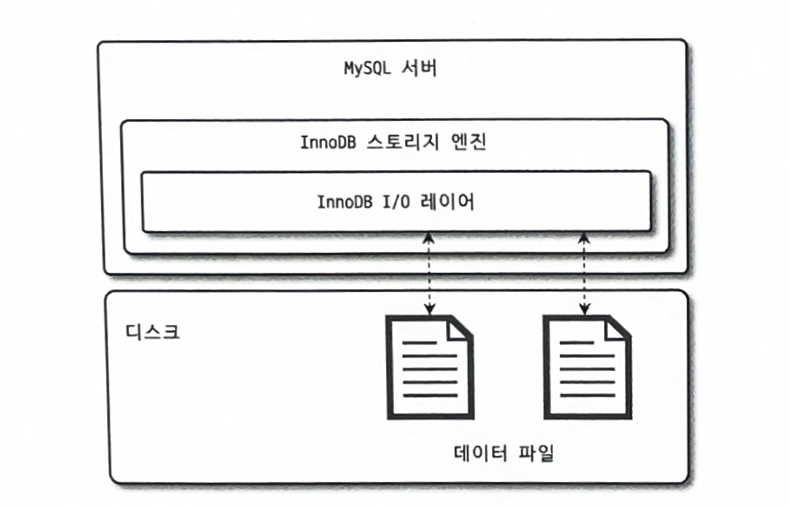
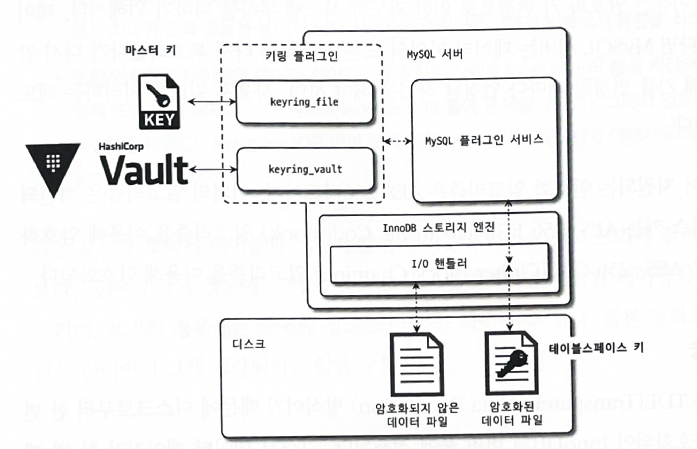
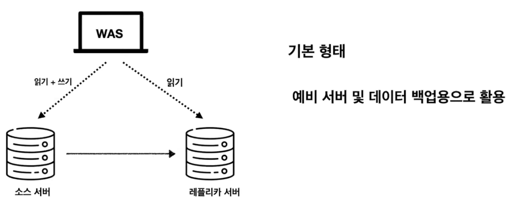
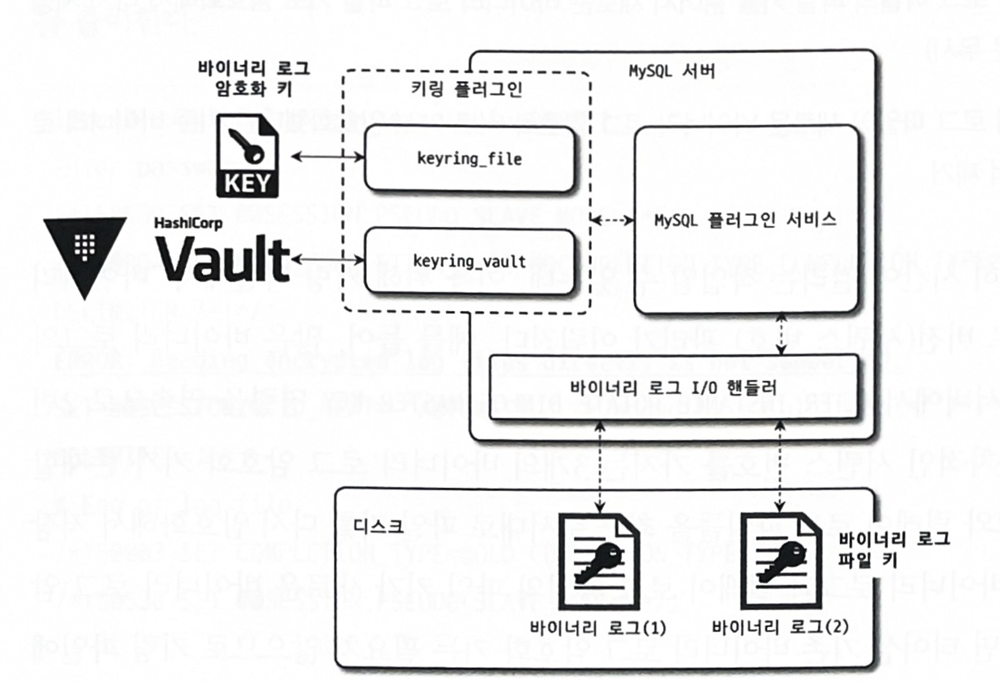

# 7. 데이터 암호화

이번 장에서는 **데이터베이스 서버가 해킹당했을 때 데이터가 노출되는 것을 방지하는 데 중요한 역할을 하는 MySQL 암호화에 대해** 알아본다.

## 7.1 MySQL 서버의 데이터 암호화

- 데이터베이스 서버와 디스크 사이의 **데이터 읽고 쓰기 지점에서 암호화 또는 복호화를 수행함 따라서**  **InnoDB 스토리지 엔진의 I/O 레이어에서만 데이터 암호화 및 복호화 과정이 실행됨**



- MySQL 서버에서 사용자의 쿼리를 처리하는 과정에서 암호화된 테이블도 그렇지 않은 테이블과 동일한 쿼리 처리 과정을 거침
    - 데이터베이스가 내부적으로 암호화를 처리하므로, 사용자는 일반적인 데이터베이스 작업을 수행하는 것처럼 작업하면 되기 때문에
- 이러한 암호화 방식을 TDE(Transparent Data Encryption **투명한 데이터 암호화**) 방식 이라고 한다.

### 7.1.1 2단계 키 관리

- TDE에서 암호화 키는 키링(KeyRing) 플러그인에 의해 관리된다.
- 여러 키링 관리 플러그인이 존재하지만 이는 다 마스터 키를 관리하는 방법만 다르고 작동하는 방식은 동일하다.
- 키링 플러그인은 **2단계(2-Tier) 키 관리 방식**을 사용함

  

- MySQL 서버에서는 두 가지 키로 암호화를 한다
    - **마스터 키  -  모든 테이블스페이스 키를 보호하는데 사용**
    - **테이블스페이스 키 (private key) - 테이블스페이스에 저장된 데이터 및 인덱스 암호화**

- 외부 키 관리 솔루션 또는 디스크 파일에서 마스터 키를 가져옴
- 암호화된 테이블이 생성될때 마다 해당 테이블을 위한 테이블스페이스 키를 발급함
- MySQL 서버는 **마스터 키를 이용해 테이블스페이스 키를 암호화**해서 각 테이블의 데이터 파일 헤더에 저장함
- 테이블스페이스 키는 테이블이 삭제되지 않는 이상 절대 변경되지 않음
- 마스터 키는 외부로 노출될 수 있기 때문에 주기적으로 변경해야 함

    ```sql
    ALTER INSTANCE ROTATE INNODB MASTER KEY;
    ```


참고 :

테이블스페이스 키는 AES-256( 대칭키 암호화 알고리즘 )을 이용 - 동일한 키를 이용하여 암호화 복호화

RSA-256( 비대칭키 암호화 알고리즘 ) - 공개 키 , 개인 키를 사용하여 데이터 암호화 및 복호화

### 7.1.2 암호화와 성능

- MySQL 서버의 암호화는 TDE 방식이기 때문에 디스크로부터 한 번 읽은 데이터 페이지는 복호화되어 InnoDB 버퍼 풀에 적재됨
    - 데이터 페이지가 한 번 메모리에 적재되면 암호화되지 않은 테이블과 동일한 성능을 보인다.
- InnoDB 버퍼 풀에 존재하지 않는 데이터를 읽을 경우
    - 테이블 복호화 과정을 한번 거쳐야 하기 때문에 해당 시간 만큼 쿼리 처리가 지연됨
- 암호화된 테이블이 변경되는 경우
    - 다시 암호화 하여 디스크에 넣어야 하기 때문에 디스크 저장 시 추가 시간이 걸림
- SELECT, UPDATE, DELETE 명령을 실행하는 경우
    - **필요한 데이터 페이지가 버퍼 풀에 있는지 확인하고, 없다면 디스크에서 읽어와야 한다. 해당 과정에서 복호화를 해야함**
    - 따라서 새롭게 디스크에서 읽어야 하는 데이터 페이지의 개수에 따라 복호화 지연이 발생함
- 같은 테이블에 대해 암호화와 압축이 동시에 적용되면 **압축을 먼저 실행하고 암호화를 적용함**
    - 암호화된 결과문(랜덤 바이트 배열) 은 압축률이 떨어지기 때문에 압축 효율을 높이기 위해
- 암호화된 테이블의 경우 읽기는 3~5배 정도 느리며 , 쓰기는 5~6배정도 느리다.

  

### 7.1.3 암호화와 복제



- MySQL 서버의 복제에서 레플리카 서버는 TDE를 이용한 암호화 사용 시 마스터 키와 테이블스페이스 키는 기본적으로 새로 할당된다.
    - 소스 서버와 레플리카 서버는 서로 각자의 마스터 키와 테이블스페이스 키를 관리하기 때문에 복제 멤버들의 데이터 파일은 암호화 되기 전의 값이 동일하더라도 실제 암호화된 데이터가 저장된 데이터 파일의 내용은 완전히 달라진다.
- 마스터키 로테이션을 실행하면 소스 서버와 레플리카 서버가 서로 다른 마스터 키를 새로 발급받는다.

```sql
ALTER INSTANCE ROTATE INNODB MASTER KEY;
```

- 백업을 할 경우 TDE의 키링 파일을 백업하지 않으면 데이터를 복구 할 수 없게 된다.
    - 마스터 키를 같이 백업해야한다.

---

## 7.2 keyring_file 플러그인 설치

- `keyring_file` 플러그인은 테이블스페이스 키를 암호화하기 위해 **마스터 키를 디스크 파일로 관리**함
- TDE 플러그인은 가장 빨리 초기화 되어야 한다. (TDE가 초기화되지 않으면, 새로운 데이터가 암호화되지 않고 저장될 수 있기 때문에**)**
    - MySQL 서버의 설정 파일 (my.cnf) 수정
        - 라이브러리 명시    `early-plugin-load = keyring_file.so`
        - 마스터 키를 저장할 파일 경로 설정  `keyring_file_data = /very/secure/directory/tde_master.key`

---

## 7.3 테이블 암호화

키링 파일 플러그인은 마스터 키 생성/관리 까지만 담당하기 때문에 어떤 플러그인을 쓰더라도 **테이블 생성 및 활용 방식은 동일하다.**

### 7.3.1 테이블 생성(TDE)

- 테이블 생성 구문 마지막에 `ENCRYPTION='Y'` 옵션만 추가로 넣으면 된다.

```sql
mysql> CREATE TABLE tab_encrypted (
		id INT,
        data VARCHAR(100),
        PRIMARY KEY(id)
	) ENCRYPTION='Y';
```

- 모든 테이블에 대해 암호화를 적용하고자 한다면 `default_table_encryption` 시스템 변수를 ON으로 설정하면 된다.

### 7.3.2 응용 프로그램 암호화와의 비교

- 응용프로그램 암호화 : 데이터가 데이터베이스에 저장되기 전에 응용 프로그램 단에서 암호화 처리
    - 주로 중요한 정보를 가진 컬럼 단위로 암호화를 수행
    - 응용프로그램 단에서 데이터를 암호화 해 넣을 경우, 암호화된 컬럼은 인덱스를 생성 하더라도 인덱스를 100% 활용하지 못할 수 있다.
        - 정렬이 불가능하기 때문에 Between AND(범위 조회) 문이나 ORDER BY LIMIT 을 사용할 수 없음.

결론: MySQL 서버 암호화와 응용 프로그램 암호화 기능 중 선택할 수 있는 상황이면 MySQL 서버 암호화를 선택 하는게 좋다.

### 7.3.3 테이블스페이스 이동

- 테이블을 다른 서버로 복사해야 하는 경우 또는 특정 테이블의 데이터 파일만 백업했다가 복구하는 경우라면 테이블스페이스 이동(Export & Import)기능이 레코드를 덤프했다가 복구하는 방식보다 훨씬 빠르고 효율적이다.
- FLUSTH TABLES 명령으로 테이블스페이스 Export 가능

```sql
mysql> FLUSH TABLES source_table FOR EXPORT;
```

- 암호화된 테이블의 경우 테이블스페이스 이동 기능을 사용할 때는 추가적으로 데이터 파일과 임시 마스터 키가 저장된 \*.cfp 파일을 함께 복사하여 목적지 MySQL 서버로 전달해야 한다.


---

## 7.4 언두 로그 및 리두 로그 암호화

- 기존에는 테이블 암호화를 적용해도 리두 로그나 언두 로그, 그리고 복제를 위한 바이너리 로그에는 평문으로 저장되었다. (데이터 유출 위험, 변조 가능성 등의 위험)
- MySQL 8.0.16 버전부터는 InnoDB 스토리지 엔진의 리두 로그와 언두 로그를 암호화된 상태로 저장할 수 있게 개선됐다.
    - `innodb_undo_log_encrypt`, `innodb_redo_log_encrypt` 시스템 변수 이용
- 리두 로그와 언두 로그를 위한 각각의 프라이빗 키가 발급되고, 해당 프라이빗 키는 마스터 키로 암호화되어 리두 로그 파일과 언두 로그 파일의 헤더에 저장됨

> InnoDB 리두 로그의 암호화 여부 확인 방법
>
>
> ```sql
> mysql> SHOW GLOBAL VARIABLES LIKE 'innodb_redo_log_encrypt';
> +-------------------------+-------+
> | Variable_name           | Value |
> +-------------------------+-------+
> | innodb_redo_log_encrypt | OFF   |
> +-------------------------+-------+
> 
> mysql> INSERT INTO enc VALUES (2, 'Real-MySQL');  // 암호화 전 
> 
> mysql> SET GLOBAL innodb_redo_log_encrypt=ON; // 암호화 후
> mysql> INSERT INTO enc VALUES (2, 'Real-MongoDB');
> 
> //검색한 문자열이 존재한다면 grep 명령은 반환 값으로 "0"을 리턴한다.
> linux> grep 'Real-MySQL' ib_logfile0_ib_logfile1
> Binary file ib_logfile0 matches
> linux> echo $?
> 0
> 
> // 검색한 문자열이 존재하지 않으면 grep 명령은 반환 값으로 "1"을 리턴한다.
> linux> grep 'Real-MongoDB' ib_logfile0_ib_logfile1
> linux> echo $?
> 1
> ```
>

grep 명령을 이용한 단순한 검색 결과에서 암호화되기 전에 INSERT한 "Real-MySQL" 문자열은 검색되지만, 암호화 이후 INSERT된 "Real-MongoDB" 문자열은 검색되지 않는 것을 확인할 수 있다.

---

## 7.5 바이너리 로그 암호화

- **바이너리 로그와 릴레이 로그 파일 또한 리두 로그나 언두 로그처럼 평문을 저장**한다.
- **바이너리 로그는 의도적으로 상당히 긴 시간 동안 보관**하기 때문에 바이너리 로그 파일의 암호화는 상황에 따라 중요도가 높아질 수 있다.

### 7.5.1 바이너리 로그 암호화 키 관리

- 바이너리 로그와 릴레이 로그 파일 데이터의 암호화를 위해 **2단계 암호화 키 관리 방식을 사용**함

  

- **바이너리 로그 파일 키로 로그 파일의 데이터를 암호화**해서 디스크에 저장함
- **파일 키는 바이너리 로그 암호화 키로 암호화**해서 각 바이너리 로그와 릴레이 로그 파일의 헤더에 저장(마스터 키 역할 수행)
- 파일 키는 바이너리 로그와 릴레이 로그 파일 단위로 자동 생성되어 해당 로그 파일의 데이터 암호화에만 사용됨

### 7.5.2 바이너리 로그 암호화 키 변경

- 바이너리 로그 암호화 키 변경

```sql
ALTER INSTANCE ROTATE BINLOG MASTER KEY 
```

변경 과정

1. 새로운 바이너리 로그 암호화 키 발급 및 키링 파일에 저장.
2. 바이너리 로그와 릴레이 로그 파일 스위치.(새로운 파일)
3. 새 로그 파일 암호화를 위한 파일 키 생성 및 마스터 키로 암호화.
4. 기존 로그 파일 키를 새 키로 암호화하여 재저장.
5. 모든 로그 파일이 새 키로 암호화되면 기존 키 제거.

### 7.5.3 mysqlbinlog 도구 활용

**`mysqlbinlog` 도구는 MySQL 데이터베이스에서 바이너리 로그 파일을 읽고 해석하는 데 사용되는 유틸리티**

- 바이너리 로그 암호화 키는 MySQL 서버만 가지고 있어서 바이너리 로그 파일을 외부에서 복호화가 불가능하다.
- `mysqlbinlog`를 활용해서 MySQL 서버에 접속해 바이너리 로그를 가져오는 방법이 유일
    - `linux> mysqlbinlog --read-from-remote-server -uroot -p -vvv mysql-bin.000011`