# 8. 인덱스

## 8.1 디스크 읽기 방식

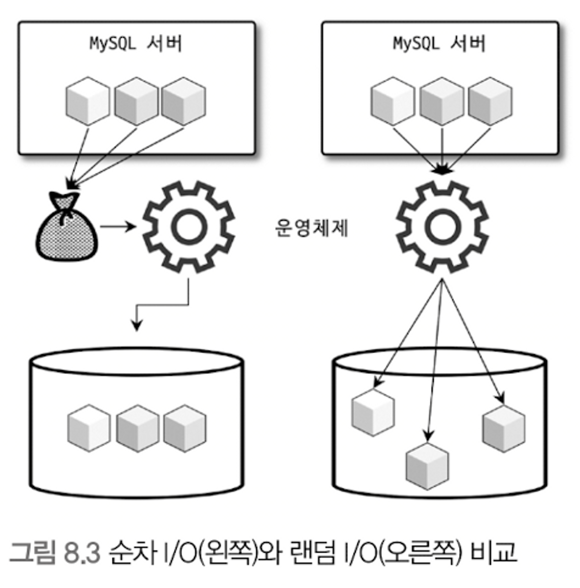  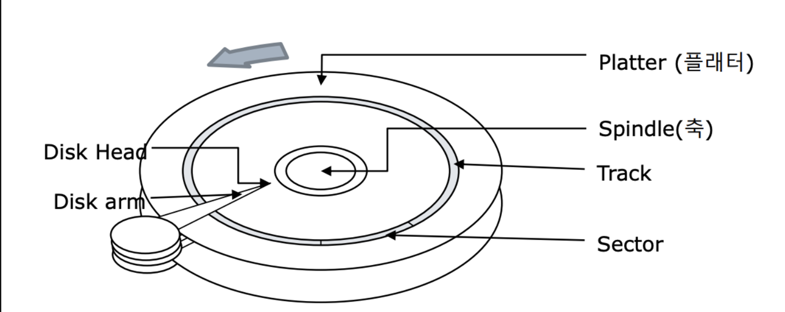

- **순차 I/O**

읽어야하는 데이터가 연속적으로 있어 쭉 읽기만 하는 것

- **랜덤 I/O**

하드 디스크 드라이브의 플래터를 돌려서 읽어야 할 데이터가 저장된 위치로 디스크 헤더를 이동시킨 다음 데이터를 읽는 것

디스크의 성능은 디스크 헤더의 위치 이동 없이 얼마나 많은 데이터를 한번에 기록하느냐에 따라 결정된다.  따라서, 랜덤 I/O 작업이 작업 부하가 훨씬 크다는 것을 알 수 있다.

데이터베이스의 성능 튜닝은 랜덤 I/O 를 줄이는 것이다.

랜덤 I/O를 줄인다는 것은 꼭 필요한 데이터만 읽도록 쿼리를 개선하는 것을 의미한다.

---

## **8.2 인덱스란?**

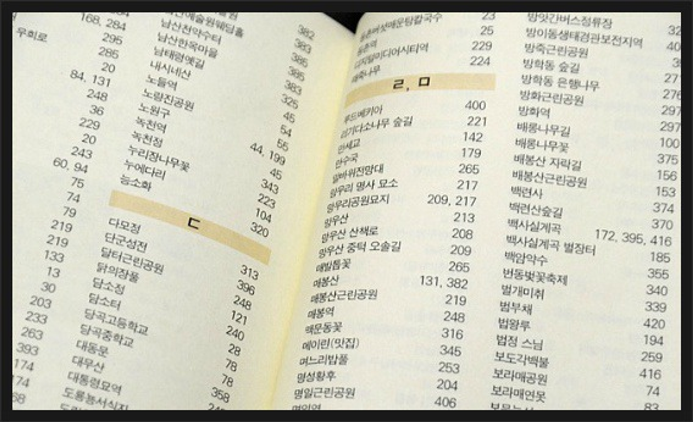


인덱스:  책의 맨 끝에 있는 찾아보기

페이지 번호:  데이터 파일에 저장된 레코드의 주소

책의 내용:  데이터 파일

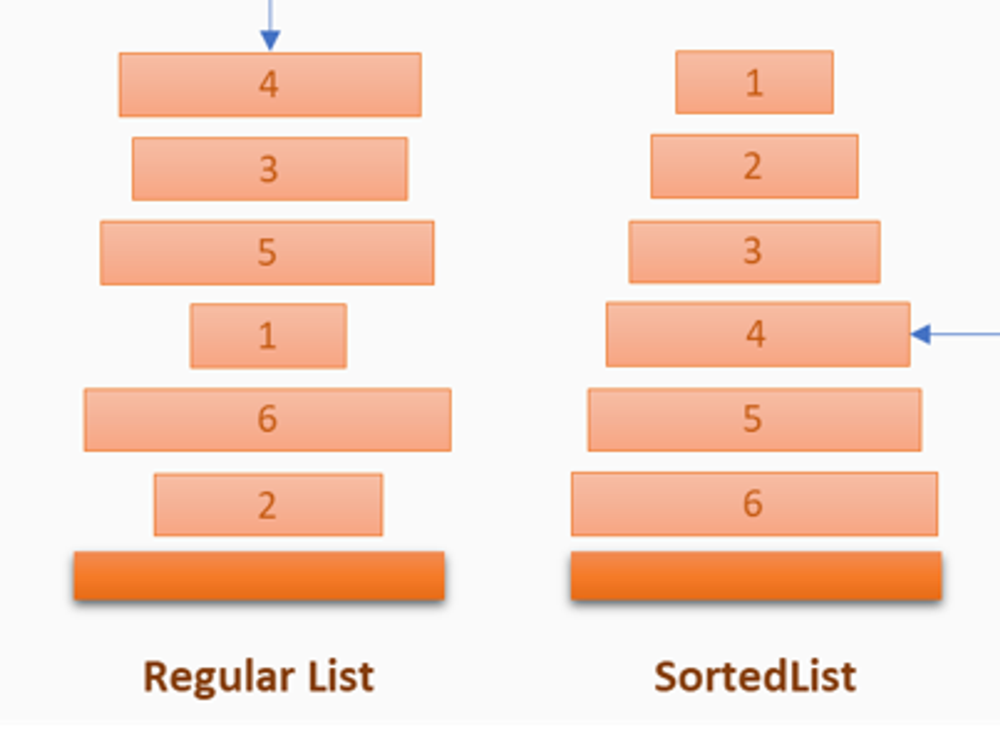

DBMS의 인덱스의 자료 구조 : SortedList

SortedList의 장단점은?

- 저장하는 과정이 복잡하고 느리지만, 아주 빨리 원하는 값을 찾아올 수 있다.
- Insert, update, delete 문장의 처리가 느려진다. 하지만 select 문장은 빠르다.

---

## 8.3 B-tree 인덱스

B(Balanced)-Tree 는 DB에서 가장 일반적으로 사용되는 인덱스 알고리즘이다.

### **8.3.1 B-Tree 인덱스 - 구조 및 특성**

최상위 : 루트 노드

중간 노드 : 브랜치 노드

가장 하위에 있는 노드 : 리프 노드

InnoDB 사용하는 구조

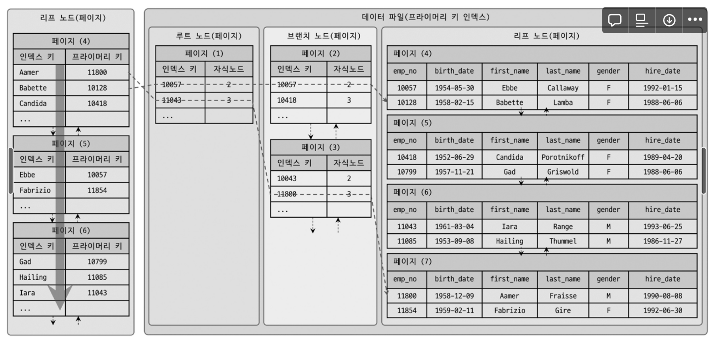

세컨더리 인덱스는 프라이머리 키를 주소처럼 사용

따라서 레코드를 읽을 때, 데이터 레코드를 바로 찾지 않고 다시 한 번 프라이머리 키 인덱스의 루트 노드로 가는 모습을 볼 수 있다.

참고)
[비클러스터형 인덱스와 클러스터형 인덱스](https://hudi.blog/db-clustered-and-non-clustered-index)

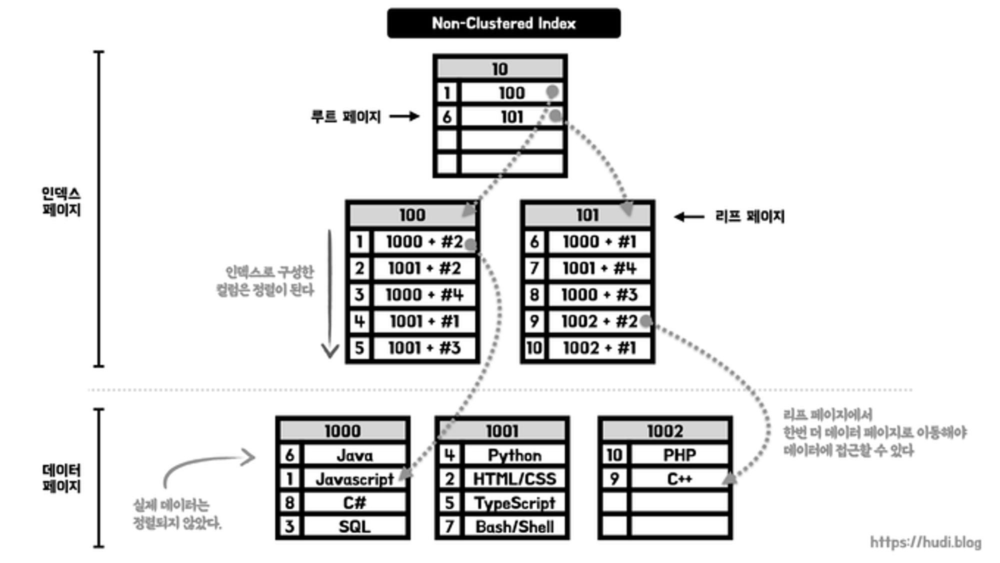

비클러스터형 : 컬럼은 정렬되지만 실제 데이터는 정렬되지 않고 물리적으로 저장하지도 않음

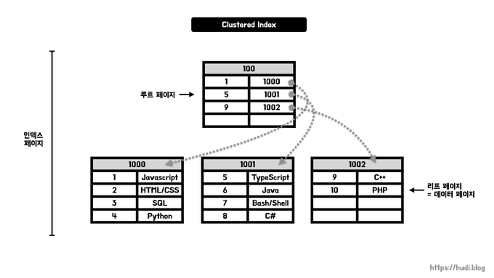

클러스터형 : 데이터와 함께 **전체 테이블이 물리적으로 정렬**된다

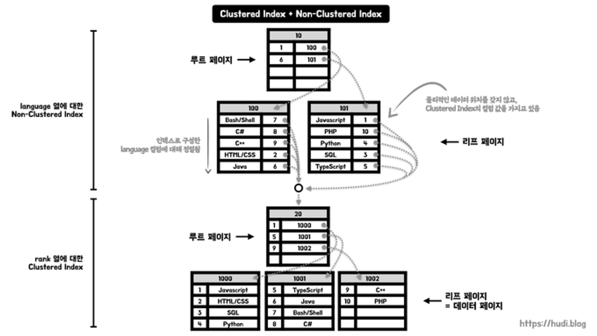

**클러스터형 인덱스와 비클러스터형 인덱스의 혼합 :** 비클러스터형 인덱스를 먼저 거치고, 이어 클러스터형 인덱스를 거쳐 데이터를 찾는다.

### 8.3.2 B-Tree 인덱스 키 추가 및 삭제

테이블의 레코드를 저장하거나 변경하는 경우 인덱스 키 추가나 삭제 작업이 발생

- 인덱스 키 추가,삭제,변경 등

인덱스 추가로 인해 테이블에 레코드를 추가하는 작업의 비용 1이라고 하면

인덱스에 키를 추가하는 비용은 1.5로 예측 가능

레코드 추가 작업 + 인덱스 키 추가 작업 으로 인해 쓰기,수정,삭제 작업에 리소스가 더 많이 할당된다!

- 인덱스 키 검색

인덱스를 추가하고 정렬하는데 드는 리소스를 감수하고 인덱스를 쓰는 이유는 바로 `조회 성능` 때문이다.

b-tree 검색시 주의점:

- 100% 일치 또는 앞 부분만 일치 , 부등호 비교 조건에서는 인덱스를 활용할 수 있지만, 인덱스를 구성하는 키 값의 뒷부분만 검색하는 용도로는 인덱스를 사용할 수 없다.

```sql
ex) 이름이 “yeob”인 사람 검색 → 인덱스 O
ex) 이름이 “ye”로 시작하는 사람 검색 → 인덱스 O
```

- 인덱스를 이용한 검색 시 인덱스의 키 값에 변형이 가해진 후 비교되는 경우는 사용할 수 없다.
- InnoDB에선 데이터를 읽어오며 해당 레코드의 잠금을 획득하는데, 인덱스가 설정되어 있지 않아서 테이블 풀 스캔을 하게 되면 많은 레코드와 갭이 잠기게되어 성능 문제나 데드락이 발생할 수 있다.

  → **인덱스 설계가 매우 중요하다.**


### 8.3.3 **B-Tree 인덱스 사용에 영향을 미치는 요소**

- 인덱스 키 값의 크기

  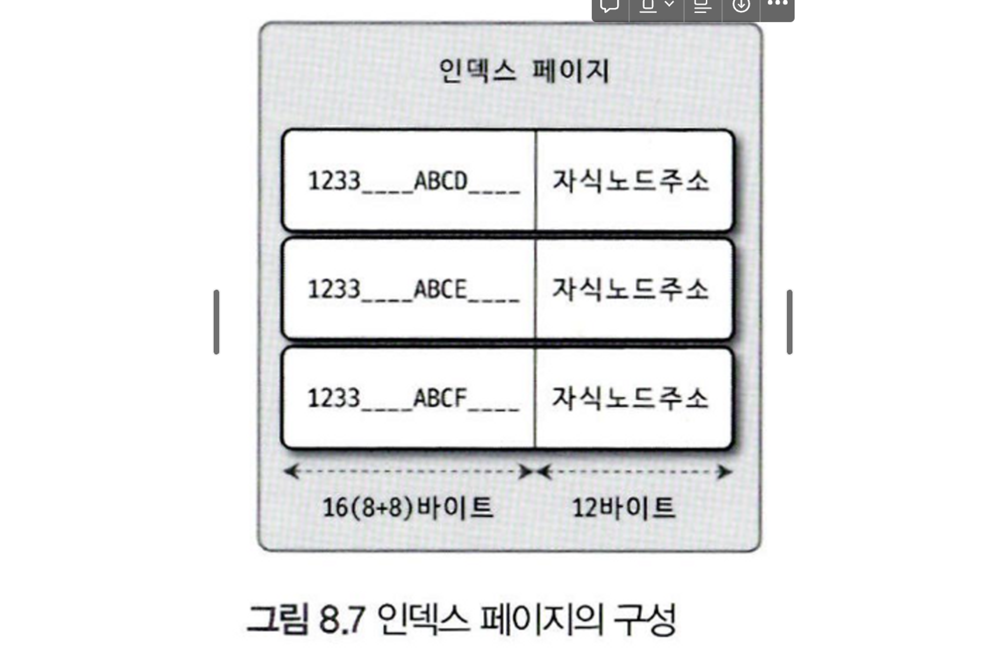
- 
    - 디스크에 데이터를 저장하는 가장 기본 단위를 “**페이지**” 라 하고 인덱스도 페이지 단위로 관리된다.
    - **인덱스 키의 크기가 커지면 전체적인 인덱스의 크기도 커진다.**

      → 메모리에 캐시해 둘 수 있는 레코드 수는 줄어들어 성능이 저하될 수 있다.

- B-Tree 깊이

  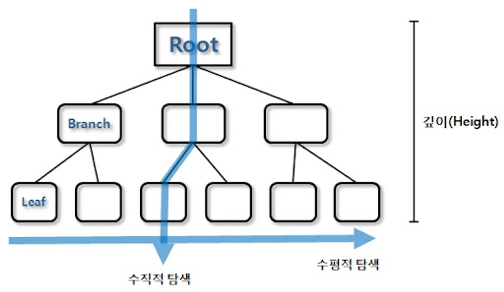
- 
    - **인덱스 키 값의 크기가 커지면 페이지가 담을 수 있는 키 값의 개수가 적어지고, 같은 레코드 건수여도 깊이가 깊어져 디스크 읽기가 더 많이 필요**합니다.

- **선택도(기수성)**
    - 모든 인덱스 키 값 가운데 유니크한 값의 수를 의미한다.
    - 인덱스는 선택도가 높을 수록 검색 대상이 줄어들기 때문에 더 빨리 처리 된다.
        - 선택도가 낮다면 더 많은 데이터를 조회할 것이고, 높다면 더 적은 데이터를 조회하기 때문

- **읽어야 하는 레코드의 건수**
    - 인덱스를 통해 레코드를 읽는 것은 인덱스를 거치지 않는 것 보다 높은 비용이 든다.
        - 만약 100만 건 중 50만 건을 읽을 때, 전체 테이블을 모두 읽어 50만개를 버릴지, 인덱스를 통해 필요한 50만개를 읽어올 지 어떤것이 더 효율적인지 판단해야 한다.
    - 일반적인 dbms의 옵티마이저는 인덱스를 통해 레코드 1건을 읽는 것이, 테이블에서 직접 레코드 1건을 읽는 것 보다 4~5배의 비용이 드는 것으로 추산
        - 레코드가 전체 테이블의 20~25%를 넘어서는 인덱스를 이용하지 않고 테이블을 모두 읽어 필터링하는 것이 효율적

### 8.3.4 B-Tree 인덱스를 통한 데이터 읽기

Mysql이 어떻게 인덱스를 이용해 실제 레코드를 읽어오는지 살펴 보자.

- **인덱스 레인지 스캔**

  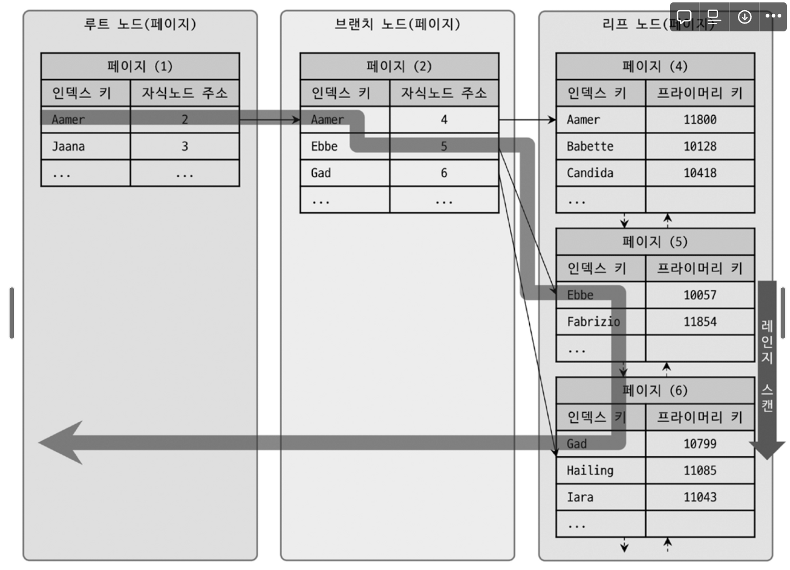
- 
    - 검색해야 할 인덱스의 범위가 결정됐을 때 사용하는 방식이다.
    - 레코드의 시작점을 찾는다.
    - 탐색된 위치부터 필요한 만큼 인덱스를 차례대로 읽는다.
        - 해당 인덱스를 구성하는 컬럼의 정순 or 역순으로 정렬된 상태로 레코드를 가져온다.
    - 읽어온 인덱스 키와 레코드 주소를 이용해 레코드를 읽는다.
        - 레코드 한 건 한 건 마다 랜덤 I/O가 일어난다.
        - 인덱스를 통해 레코드를 읽는 작업은 그냥 읽는 것 보다 비용이 많이든다.

- **인덱스 풀 스캔**

  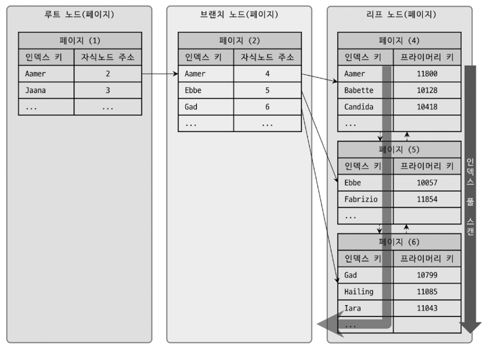
- 
    - 인덱스의 처음부터 끝까지 모두 읽는 방식을 인덱스 풀 스캔이라고 한다.
    - 쿼리의 조건절에 사용된 칼럼이, 인덱스의 첫 번째 칼럼이 아닌 경우 사용됩니다.
        - 인덱스가 a,b,c 칼럼의 순서로 걸려있지만, 쿼리 조건절은 b나 c로 검색하는 경우
    - 인덱스 풀 스캔은 인덱스에 포함된 칼럼만으로 쿼리를 처리할 수 있는 경우, 테이블의 레코드를 읽을 필요가 없습니다. 세컨더리 인덱스에 포함된 키 값만 가져오면 되기 때문입니다
        - 커버링 인덱스

- **루스 인덱스 스캔**

  

    - 인덱스 레인지 스캔과 비슷하지만 중간에 필요없는 인덱스 키 값은 무시하고 다음으로 넘어가는 형태
    - 일반적으로 Group by 또는 집합 함수 가운데 Max() 또는 Min() 함수에 대해 최적화를 하는 경우 사용

- **인덱스 스킵 스캔**

  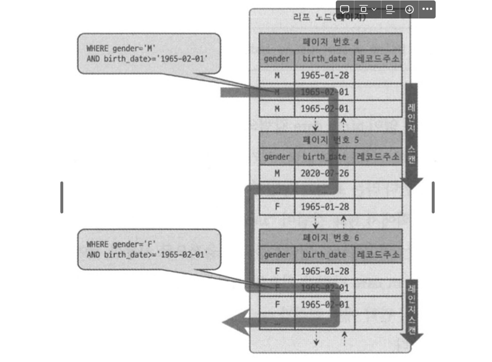
- 
    - 만약 한 테이블에 컬럼 두개에 인덱스를 (a,b) 순서대로 건다면 조건절에서 a,b 를 모두 사용한다면 인덱스를 쓰지만, b만 쓰면 인덱스를 사용할 수 없다.
    - 그러나 Mysql 8.0 버전부터는 b만으로도 인덱스 검색이 가능하게 해주는 인덱스 스킵 스캔 최적화 기능이 도입
    - `select gender, birth_date from employees where birth_date>='1965-02-01’` 위와 같은 쿼리를 사용할 때 gender 의 유니크 값을 찾아내어 내부적으로 아래 보이는 쿼리들을 실행하는 것과 비슷한 형태의 최적화를 실행하게 된다.

  `select gender, birth_date from employees where gender='M' and birth_date>='1965-02-01'`

  `select gender, birth_date from employees where gender='F' and birth_date>='1965-02-01'`


### **8.3.5 다중 칼럼 인덱스**

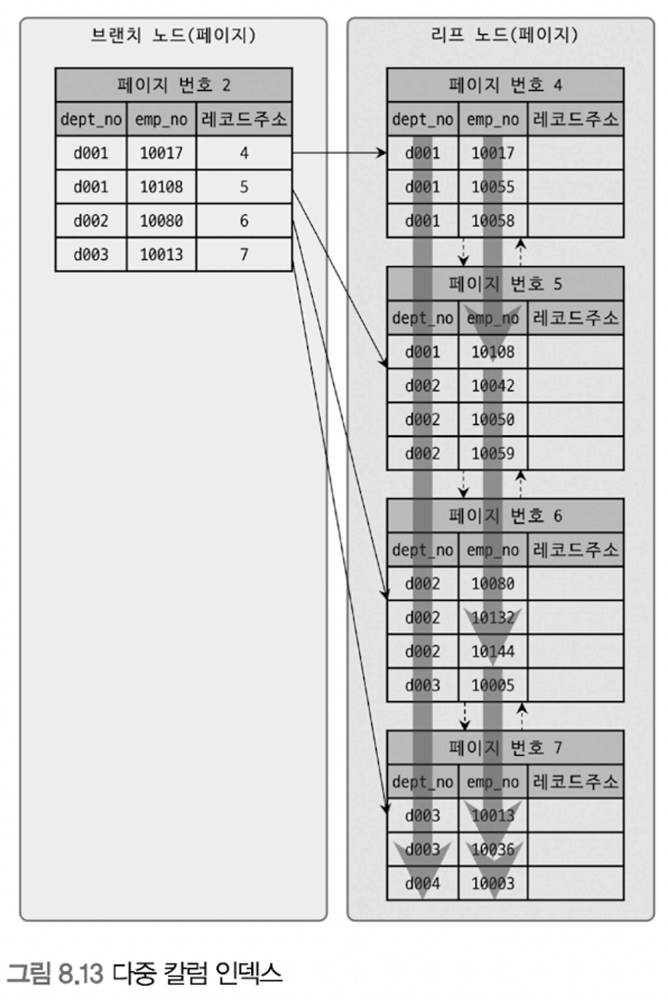

- 두 개 이상의 칼럼으로 구성된 인덱스이다.
- 리프 노드를 보면, 두 번째 칼럼은 첫 번째 칼럼에 의존해서 정렬돼 있는 것을 볼 수 있음.
    - 기본적으로 B-tree 인덱스는 왼쪽 값을 기준으로 오른쪽 값이 정렬 된다.

→ 따라서 다중 칼럼 인덱스는 각 칼럼의 순서가 굉장히 중요하다.

### 8.3.6 **B-Tree 인덱스의 정렬 및 스캔 방향**

인덱스의 키 값은 오름차순 혹은 내림차순으로 정렬되는데, 이를 어느 방향으로 읽을지는 옵티마이저의 실행계획에 따라 결정된다.

- **인덱스의 정렬**

MySQL 5.7 까지는 정렬 순서를 혼합해서 쓸 수 없었지만, 8.0 부터는 아래와 같은 형태로 정렬 순서를 혼합해 쓸 수 있다.(ASC DESC 혼합)

`CREATE INDEX ix_teamname_userscore ON employees (team_name ASC, user_score DESC)`

- **인덱스 스캔 방향**

옵티마이저는 필요한 인덱스가 존재하는 위치에 따라, 인덱스를 정순으로 읽거나, 역순으로 읽을 수 있습니다.   `SELECT * FROM employees ORDER BY first_name DESC LIMIT 5`  와 같이 테이블에 first_name에 정의된 인덱스를 역순으로 읽으면서 처음 5개만 가져오면 된다. 이는 옵티마이저가 최적의 실행계획을 만들어 준다.

결론적으로, 정순이든 역순이든 자주 사용되는 정렬 순서로 인덱스를 생성하는 것이 효율적이다.

### **8.3.7 B-Tree 인덱스의 가용성**

어떤 조건에서 인덱스를 사용할 수 있고, 사용할 수 없게 되는지 알아보자

아래의 경우 인덱스를 사용할 수 없다.

- **NOT-EQUAL로 비교**  **`WHERE column_i <> 'value'`**
- **LIKE %something 비교**   **`WHERE column_i LIKE '%value'`**
- 데이터 타입이 서로 다른 비교 **`WHERE column_i = '123'` (column_i가 INT인 경우)**

→ 인덱스를 사용할 수 없는 다양한 경우들이 존재하므로 인덱스 사용 시 주의해야 한다.

---

## 8.4 R-tree 인덱스

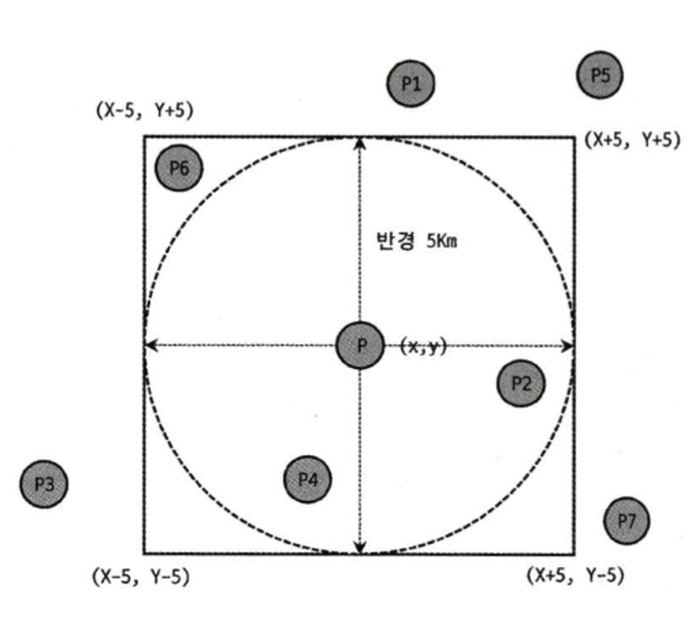

공간 인덱스:  2차원 데이터를 인덱싱 하고 검색하는 목적으로 사용

- 주로 위도, 경도, 좌표등을 사용하는 GPS 등의 공간정보가 필요할 때 사용

---

## 8.5 전문 검색 인덱스(**Full Text search)**

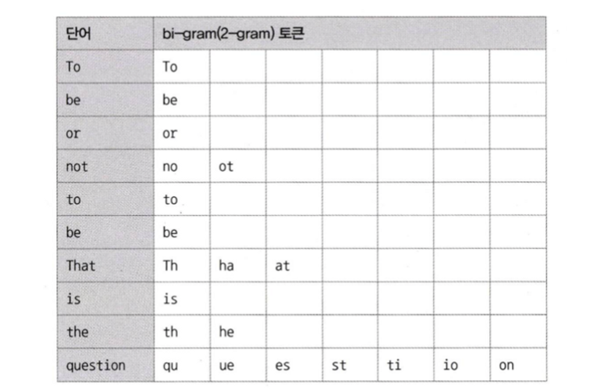

대량의 텍스트 데이터를 효율적으로 검색할 수 있도록 만든 구조

주로 문서 검색, 웹 검색 엔진, 전자상거래 제품 검색, 로그 분석, 추천 시스템 등에서 활용

---

## 8.6 함수 기반 인덱스

칼럼의 값을 변형해서 만들어진 값에 대한 인덱스

함수 기반 인덱스를 구현하는 방법 두 가지

- 가상 칼럼을 이용한 인덱스
- 함수를 이용한 인덱스

### 8.6.1 **가상 칼럼을 이용한 인덱스**

**가상 칼럼은 실제로 데이터를 저장하지 않고, 다른 칼럼의 값을 기반으로 계산된 값을 제공하는 칼럼**

first_name, last_name 두 칼럼을 합쳐서 검색해야 하는 경우

기존 : full_name이라는 칼럼을 추가하고 모든 레코드에 대해 full_name을 업데이트하는 작업

가상 칼럼 :

```
ALTER TABLE user
    ADD full_name VARCHAR(30) AS (CONCAT(first_name, ' ', last_name)) VIRTUAL,
    ADD INDEX idx_fullname(full_name);
```

만약 테이블을 조회해본다면?

**full_name 칼럼이 생성되며 해당 `full_name` 가상 칼럼은 데이터를 직접 저장하지 않고 `first_name`과 `last_name`의 값을 기반으로 동적으로 계산된 결과를 제공**

단점 :  가상 칼럼은 테이블에 새로운 칼럼을 추가하는 것과 같은 효과를 내기 때문에 실제 테이블의 구조가 변경된다.

### 8.6.2 함수를 이용한 인덱스

MySQL 8.0 버전부터는 테이블의 구조를 변경하지 않고, 함수를 직접 사용하는 인덱스 생성 가능

```sql
CREATE TABLE (
    ...
    first_name VARCHAR(10),
    last_name VARCHAR(10),
    ...
    INDEX idx_fullname((CONCAT(first_name, ' ', last_name)))
);
```

- 함수를 직접 사용하는 인덱스는 테이블의 구조는 변경하지 않고, 계산된 결괏값의 검색을 빠르게 만들어준다.
- 함수 기반 인덱스를 제대로 활용하려면 반드시 조건절에 함수 기반 인덱스에 명시된 표현식이 그대로 사용되어야 한다.

    ```sql
    SELECT * FROM 테이블명
    WHERE CONCAT(first_name, ' ', last_name) = 'Kim DongWoo';
    ```


---

## 8.7 멀티 밸류 인덱스(Json)

하나의 레코드에 여러가지 키 값을 가질 수 있는 인덱스이다.

주로 JSON의 배열 타입의 필드에 저장된 원소들에 대한 인덱스를 구현하기 위해 사용

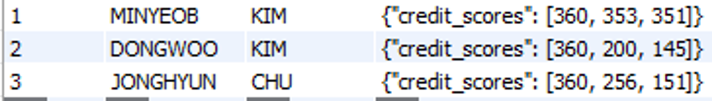

멀티 밸류 인덱스 이점:

JSON 데이터들을 미리 인덱싱하여 조회시, 필터링하고 필요한 정보만 가져옴으로써 응용 프로그램에서 처리하는 것보다 더 빠르고 효율적으로 처리 가능하다.

---

## 8.8 클러스터링 인덱스

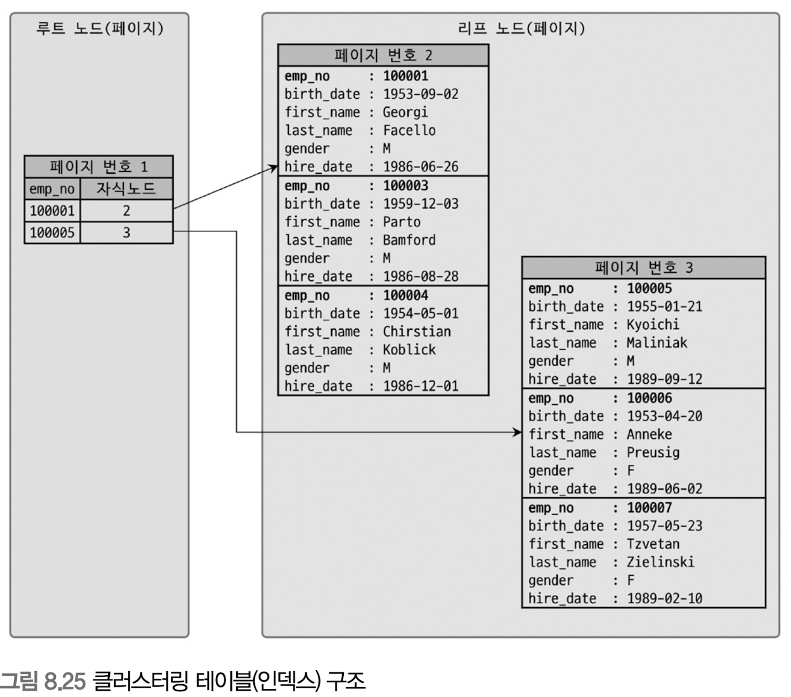

**클러스터링 인덱스 : ` 프라이머리 키`** 를 기준으로 순서에 따라 물리적으로 정렬되어 저장된 인덱스 구조(InnoDB 에서는 pk 설정 시 자동으로 만들어짐, **한 테이블에 하나만 존재**)

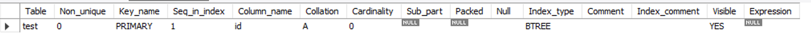
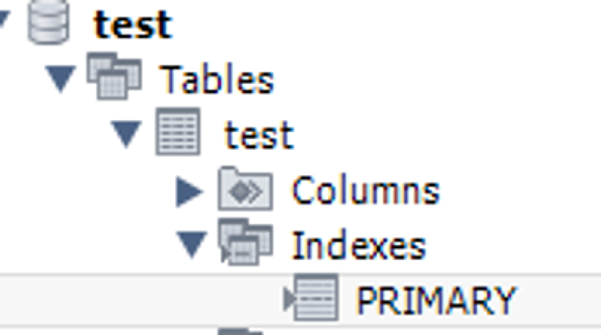

참고 : 프라이머리 키가 없다면?

> 내부적으로 대체키를 선정하여 클러스터링 인덱스를 생성하거나 자동으로 유니크한 값을 가지는 히든 칼럼을 추가하여 클러스터링 인덱스를 생성한다.
>

클러스터링 인덱스의 장점과 단점

- **장점**
    - PK 검색 시 처리 성능이 매우 빠르다.
    - 모든 세컨더리 인덱스가 PK를 가지고 있으므로 인덱스만으로 처리될 수 있는 경우가 많다. (커버링 인덱스)
- **단점**
    - 테이블의 모든 세컨더리 인덱스가 클러스터링 키(주로 pk)를 갖기 때문에 클러스터링 키 값의 크기가 클 경우 전체적인 인덱스의 크기가 커진다.
    - 세컨더리 인덱스를 통해 검색할 때 PK로 한번 더 검색해야 하므로 성능이 느리다.
    - PK를 변경할 때 레코드를 `DELETE`하고 `INSERT`하는 작업이 필요하기 때문에 처리 성능이 느리다.

---

## 8.9 유니크 인덱스

유니크 제약조건 : 테이블이나 인덱스에 같은 값이 2개 이상 저장될 수 없음을 의미

유니크 제약조건을 걸면 내부적으로 유니크 인덱스가 생성된다.

```sql
CREATE TABLE test3 (
    id INT AUTO_INCREMENT PRIMARY KEY,
    name VARCHAR(50) UNIQUE,
    ...
);
```

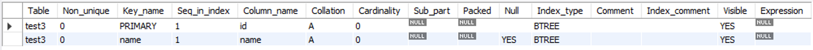

세컨더리 인덱스와의 비교

- 읽기
    - 대부분 유니크 인덱스가 빠르다고 생각하지만 사실이 아니다.
    - 같은 수의 레코드를 읽는다면 성능상 차이는 미미하다.
- 쓰기
    - 유니크 인덱스의 키 값을 쓸 때는 중복된 값이 있는지 여부를 체크하는 과정이 필요하다.
    - 유니크하지 않은 일반 세컨더리 인덱스보다 유니크 인덱스의 작업이 더 느리게 작동한다.

그럼 왜쓰지 ??

핵심은 유니크 제약조건을 통해 데이터 무결성을 보장하는 것이다.(대신 성능은 안좋아짐)

또한 유니크 인덱스가 있으면 성능이 좋을거라는 생각을 버려야 겠다.

---

## 8.10 외래키

외래키 제약이 설정되면 자동으로 연관되는 테이블의 컬럼에 인덱스가 생성된다.

```sql
CREATE TABLE test4 (
    id INT AUTO_INCREMENT PRIMARY KEY,
    test_id INT,
    ...
    FOREIGN KEY (test_id) REFERENCES test(id)
);
```

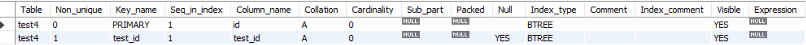

주요 두가지 특징

- 테이블의 변경 (쓰기 잠금)이 발생하는 경우에만 잠금 경합 (잠금 대기) 가 발생한다.
- 외래키가 연관되지 않은 칼럼의 변경은 상관없다.

### **8.10.1 자식 테이블의 변경이 대기하는 경우**

부모의 허락이 있을 때까지 기다림

```sql
UPDATE tb_child SET pid=2 WHERE id=100;
```

### **8.10.2 부모 테이블의 변경이 대기하는 경우**

부모가 자식의 쓰기 잠금이 해제될 때까지 기다려야 한다.

```sql
DELETE FROM tb_parent WHERE id=1;
```

핵심은 외래 키가 물리적으로 생성되면 이처럼 연관 테이블에 읽기 잠금이 일어나기 때문에 쿼리 동시처리에 영향을 미치므로 이것을 고려해서 외래 키 모델링을 진행 해야 한다는 것이다.