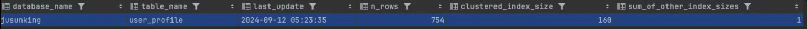
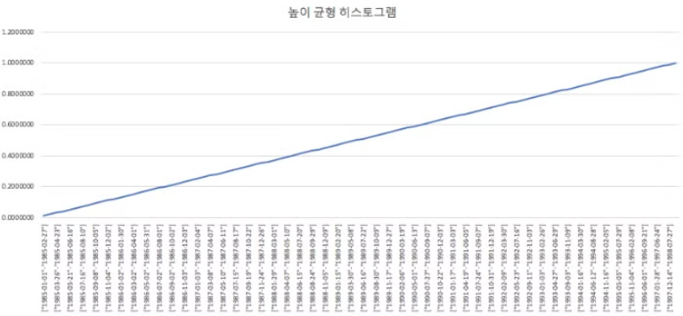
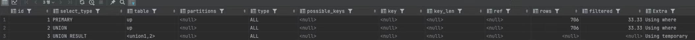

옵티마이저가 사용자의 쿼리를 최적으로 처리될 수 있게 쿼리의 실행 계획을 수립할 수 있어야 한다.

왜? 옵티마이저가 항상 우리의 개입 없이 좋은 실행 계획을 만들어내지 않기 때문에

그래서 DBMS 서버는 EXPLAIN명령어로 옵티마이저가 수립한 실행계획을 확인할 수 있게 해준다

MySQL 서버에서 보여주는 실행 계획을 읽고 이해하려면 MySQL 서버가 데이터를 처리하는 로직을 이해해야 한다

## 10.1 통계 정보

### 10.1.1 테이블 및 인덱스 통계 정보

10건이 있는 테이블에 엄청나게 갑자기 많은 insert를 해서 1억 건의 레코드가 저장된 테이블이 있다 통계 정보가 갱신되지 않아서 10건 처럼 되어 있다면 옵티마이저는 실제 쿼리를 실행할 때 인덱스 레인지 스캔이 아니라 풀 테이블 스캔으로 실행해서 0.1초만에 끝날걸 1시간이 소요될 수 있다

MySQL 8버전 이후부터 통계 정보 관리가 어떻게 개선됐는지도 함께 살펴보자

### 10.1.1.1 MySQL서버의 통계 정보

MySQL5.6 이전에는 테이블의 통계 정보가 메모리에 관리되고 SHOW INDEX명령어로만 인덱스 칼럼 분포도를 볼 수 있었지만 MySQL서버가 재시작되면 통계 정보가 모두 사라진다는 단점이 있었다 하지만 MySQL5.6 이후부터는 각 테이블의 통계 정보를 innodb_index_stats테이블과 innodb_table_stats 테이블로 관리할 수 있게 개선되었다

```sql
select * from mysql.innodb_table_stats WHERE table_name IN ('user_profile')
```


이렇게 나왔다

```sql
select * from mysql.innodb_index_stats
where database_name='jusunking' AND TABLE_NAME='user_profile';
```


- stat_name=’n_diff_pfx01’: 인덱스가 가진 유니크한 값의 개수
- stat_name=’n_leaf_page’: 인덱스 리프 노드 페이지 개수
- stat_name=’size’: 인덱스 트리의 전체 페이지 개수
- n_row: 전체 레코드 건수
- clustered_index_size: 프라이머리 키의 크기
- sum_of_other_index_size: 프라이머리 키를 제외한 인덱스의 크기(InnoDB 페이지 개수)

- 160 페이지의 클러스터형 인덱스 크기는 754개의 행을 가진 테이블에 적당한 수준이다 특히 행에 많은 컬럼이 있거나 데이터가 크다면 이 정도 크기가 될 수 있다
- InnoDB에서 한 페이지의 크기는 일반적으로 16KB이므로, 전체 클러스터형 인덱스 크기는 약 160 * 16KB = 2.5MB 정도로, 대부분의 데이터베이스에서는 크진 않다
- 92개의 리프 페이지는 인덱스에 저장된 데이터가 효율적으로 분배되어 있다는 의미로 해석될 수 있다. 너무 적거나 너무 많은 경우, 인덱스 효율이 떨어질 수 있지만, 92개는 일반적인 수치로 큰 문제가 없다고 한다.
- 페이지 하나는 보통 16KB 크기이므로, 92 * 16KB = 약 1.44MB의 인덱스 크기를 차지 이 정도는 작은 데이터셋으로 봤을 때 성능적으로 문제되지 않는다

영구적인 통계 정보를 사용한다면 MySQL 서버의 점검이나 사용량이 많지 않은 시간을 이용해 더 정확한 통계 정보를 수집할 수 있다. 통계정보의 정확성에 의해 쿼리의 성능이 결정되기 때문에 시간을 투자할 충분한 가치가 있다

### 10.1.2 히스토그램

MySQL 5.7버전 이전의 통계 정보는 단순히 인덱스된 칼럼의 유니크한 값의 개수만 있어서 옵티마이저의 실행 계획 최적화를 하기엔 부족했다 8.0 이후부터는 MySQL서버도 칼럼의 데이터 분포도를 참조할 수 있는 히스토그램 정보를 활용할 수 있게 됐다

히스토그램(histogram)은 테이블의 **열(column)** 값들의 분포를 분석하고 이를 기반으로 쿼리 성능을 최적화하기 위해 사용되는 통계 도구이다 히스토그램은 특정 열의 값들이 얼마나 자주 나타나는지를 구간별로 나누어 그 빈도를 나타낸다. 이를 통해 MySQL 쿼리 옵티마이저가 데이터의 분포를 파악하고, 최적의 쿼리 실행 계획을 세울 수 있다

예를 들어, 어떤 열의 값들이 몇 개의 값에만 집중되어 있고 나머지는 거의 나타나지 않는다면, 이를 기반으로 옵티마이저는 인덱스를 사용할지 여부를 판단할 수 있다

### 10.1.2.1 히스토그램 정보 수집 및 삭제

히스토그램 정보는 칼럼 단위로 관리되는데 자동으로 수집되지 않고

```sql
ANALYZE TABLE ... UPDATE HISTOGRAM
```

명령어로 수동 수집 및 관리된다. 수집된 히스토그램 정보는 시스템 딕셔너리에 함께 저장되고 MySQL 서버가 시잘될 때 딕셔너리의 히스토그램 정보를 information_schema 데이터베이스의 column_statistics 테이블로 로드한다

그래서 히스토그램 정보를 조회하려면 column_statistics 테이블을 조회하면 된다

```sql
ANALYZE TABLE jusunking.user_profile UPDATE HISTOGRAM ON gender;

SELECT * FROM information_schema.COLUMN_STATISTICS
WHERE SCHEMA_NAME='jusunking' AND TABLE_NAME='user_profile';
```

- **ANALYZE TABLE**:
    - 이 명령어는 MySQL에서 테이블에 대한 **통계 정보**를 수집하거나 갱신하는 데 사용. 옵티마이저가 테이블의 데이터를 효율적으로 쿼리하기 위한 실행 계획을 세울 때, 테이블의 통계 정보가 중요하다
- **jusunking.user_profile**:
    - 이 부분은 통계를 분석하려는 **테이블 이름**을 자종헌더. 여기서 `jusunking`은 데이터베이스 이름이고, `user_profile`은 테이블 이름
- **UPDATE HISTOGRAM**:
    - 이 명령어는 테이블의 특정 열에 대해 **히스토그램을 생성하거나 업데이트**하는 작업을 수행. 히스토그램은 해당 열의 데이터 분포를 분석하여 저장. 이를 통해 MySQL 쿼리 옵티마이저가 해당 열을 더 효율적으로 사용할 수 있도록 돕는다
- **ON gender**:
    - 히스토그램을 생성 또는 업데이트할 열(column)을 지정. 여기서는 `gender` 열에 대한 히스토그램을 생성하는 작업을 수행
    - 예를 들어, `gender` 열이 남성과 여성으로 이루어진 경우, 히스토그램은 이 열의 데이터가 남성과 여성이 각각 얼마나 많이 분포되어 있는지를 분석하게 된다

이 쿼리는 **`jusunking.user_profile` 테이블의 `gender` 열**에 대한 히스토그램을 업데이트. MySQL 옵티마이저는 `gender` 열에 대한 값들이 어떻게 분포되어 있는지를 히스토그램을 통해 파악하고, 그 정보에 기반해 쿼리를 최적화한다. 예를 들어, `gender` 값이 불균등하게 분포되어 있다면, 옵티마이저는 이를 인지하고 더 효율적인 쿼리 실행 계획을 수립할 수 있다.

```sql
{
  "buckets": [
    ["base64:type254:RkVNQUxF", 0.5546697038724373],
    ["base64:type254:TUFMRQ==", 0.9977220956719818]
  ],
  "data-type": "string",
  "null-values": 0.002277904328018223,
  "collation-id": 224,
  "last-updated": "2024-09-14 08:10:38.495276",
  "sampling-rate": 1.0,
  "histogram-type": "singleton",
  "number-of-buckets-specified": 100
}
```

- **buckets** (히스토그램 버킷):
    - 이 값은 `gender` 열의 값들이 어떤 방식으로 분포되어 있는지 나타낸다
    - 값이 Base64로 인코딩되어 있으므로 디코딩을 통해 해석

  **Base64 디코딩**:

    - `"RkVNQUxF"` → `FEMALE`
    - `"TUFMRQ=="` → `MALE`

  그래서, 두 개의 버킷은 다음과 같이 해석

    - `FEMALE`: 55.47% (0.5546697038724373)
    - `MALE`: 99.77% (0.9977220956719818)

  이 값은 `gender` 열의 값들이 테이블에서 어떤 비율로 나타나는지를 보여줌. 55.47%가 FEMALE이고, 거의 99.77%가 MALE이다. 남성 값이 FEMALE보다 많이 나타나는 것을 알 수 있다

- **data-type**: `"string"`:
    - 이 값은 해당 히스토그램이 **문자열 데이터**(string) 열에 대한 것임을 나타낸다. 즉, `gender` 열은 문자열 값(예: 'MALE', 'FEMALE')을 가지고 있다
- **null-values**: `0.002277904328018223`:
    - `gender` 열에서 **NULL** 값의 비율을 나타낸다. 이 값은 약 **0.23%** 정도의 NULL 값이 존재한다는 의미
- **collation-id**: `224`:
    - 이 값은 MySQL에서 문자열 정렬 방식을 결정하는 **Collation ID**. 여기서는 `utf8mb4_0900_ai_ci`와 관련된 ID이다
- **last-updated**: `"2024-09-14 08:10:38.495276"`:
    - 히스토그램이 **마지막으로 업데이트된 시간**을 나타낸다
- **sampling-rate**: `1.0`:
    - 이 값은 **샘플링 비율**을 나타낸다. 1.0은 전체 데이터를 샘플링하여 분석했다는 의미 즉, 데이터 전부를 기반으로 히스토그램을 생성함
- **histogram-type**: `"singleton"`:
    - 이 값은 히스토그램의 **종류** `"singleton"` 히스토그램은 값이 고유하게 나열된 히스토그램으로, 각 값의 빈도를 개별적으로 기록
- **number-of-buckets-specified**: `100`:
    - 히스토그램에서 지정된 **버킷의 개수**. `100`개의 버킷이 설정되었지만, `gender` 열의 경우 실제 값이 2개(`MALE`, `FEMALE`)로 제한되어 있으므로, 2개의 버킷만 생성된 것입니다.

버킷단위로 구분되어서 레코드 건수가 칼럼 값으 번위가 관리되는데 싱클톤 히스토그램은 칼럼이 가지는 값 별로 버킷이 할당되어 높이 균형 히스토그램에서는 개수가 균등한 칼럼값의 번위별로 하나의 버킷이 할당된다


위 그림은 싱글톤 히스토그램이며 M, F인 타입인 칼럼 2개의 대해 누적된 레코드 건수의 비율을 갖고 있다. 싱클톤 히스토그램은 코드갑소가 같이 뉴니크한 값의 개수가 상대적으로 적은 경우 사용된다


높이 균형 히스토그램은 칼럼값의 각 범위에 대해 레코드 건수 비율이 누적으로 표시된다. 그래서 기울기가 있어보이지만 실제로는 균등하게 분포되어있다고 보면 된다

히스토그램도 삭제할 수 있다. 히스토그램이 삭제되면 쿼리의 실행계획이 달라질 수 있으므로 주의해야 한다

```sql
ANALYZE TABLE jusunking.user_profile DROP HISTOGRAM ON gender;
```

히스토그램을 삭제하지 않고 옵티마이저가 히스토그램을 사용하지 않게 하려면?

```sql
SET GLOBAL optimizer_switch='condition_fanout_filter=off';
```

특정 커넥션 또는 특정 쿼리에서만 히스토그램을 사용하지 않고자 한다면

```sql
// 현재 커넥션에서 실행되는 쿼리만 히스토그램을 사용하지 않게 설정
SET SESSION optimizer_switch='condigion_fanout_fileter=off'

SLSECT /*+ SET_VAR(optimizer_switch='condition_fanout_filter=off' */ *
FROM ...
```

### 10.1.2.2 히스토그램의 용도

기존 MySQL 서버가 가지고 있던 통계 정보는 테이블의 전체 레코드 건수와 인덱스된 칼럼이 가지는 유니크한 값의 개수 정도였다. 예를들어. 테이블 레코드가 1000건이고 어떤 칼럼의 유니크한 값 개수가 100개였다면 MySQL서버는 이 칼럼에 대해 다음과 같은 동등 비교 검색을 하면 대략 10개의 레코드가 일치할거라고 나올거다

```sql
SELECT * FROM order WHERE name='matt.lee';
```

하지만 모든 레코드가 균등한 분포도를 갖지 않기 때문에 MySQL서버는 이런 부분을 고려하지 못한다. 그래서 히스토그램이 도입되었다.

히스토그램은 특정 칼럼이 가지는 모든 값에 대한 분포도 정보를 가지지는 않지만 각 범위 별로 레코드 건수와 유니크한 값의 개수 정보를 가지기 때문에 훨씬 정확한 예측을 할 수 있다.

만약에 exployees 테이블에 birthdate칼럼이 있다고 했을때

```sql
EXPLAIN SELECT * FROM employees
WHERE first_name='Zita'
AND birth_date BETWEEN '1950-01-01' AND '1960-01-01';

id = 1
select_type = simple
table = employees
type = ref
key = ix_firstname
rows = 224
filtered = 11.11
```

first_name=’Zita’ 인 레코드가 224건이고 그중에서 11.11 퍼센트인 24.8명이 1950년대 출생일거라고 예측했다

그러고 나서 birth_date 칼럽에 히스토그램 정보를 수집하고 동일한 쿼리의 실행 계획을 살펴보자

```sql
ANALYZE TABLE employees UPDATE histogram ON first_name, birth_date;

EXPLAIN SELECT * FROM employees
WHERE first_name='Zita'
AND birth_date BETWEEN '1950-01-01' AND '1960-01-01';

id = 1
select_type = simple
table = employees
type = ref
key = ix_firstname
rows = 224
filtered = 60.82
```

히스토그램을 사용한 실행 계획은 60.82퍼센트인 136.2명이 1950년대 출생일 것으로 예측했다 실제 데이터를 조회해 보면 그렇다

이렇게 단순 통계 정보만 이용한 경우와 히스토그램을 이용한 경우의 차이가 매우 큰 것을 알 수 있다

히스토그램이 없으면 옵티마이저는 데이터가 균등하게 분포돼 있을 것으로 예측한다 하지만 히스토그램이 있으면 특정 범위의 데이터가 많고 적음을 식별할 수 있다. 이게 쿼리 성능에 상당한 영향을 미칠 수 있다.

이번에는 2개의 테이블을 조인하는데, 옵티마이저 힌트를 이용해 강제로 조인의 순서를 바꿔 성능을 봐보자

```sql
SELECT /* JOIN_ORDER(e, s) */ *
FROM salaries s
INNER JOIN employees e ON e.emp_no=s.emp_no
AND e.birth_date BETWEEN '1950-01-01' AND '1960-01-01'
WHERE s.salary BETWEEN 40000 ANd 70000;

-> Empty set (0.13 sec)

SELECT /* JOIN_ORDER(s, e) */ *
FROM salaries s
INNER JOIN employees e ON e.emp_no=s.emp_no
AND e.birth_date BETWEEN '1950-01-01' AND '1960-01-01'
WHERE s.salary BETWEEN 40000 ANd 70000;
```

첫번째 쿼리는 employees 테이블을 읽고 salaries 테이블을 조인한 예제이고 두번재는 반대로 했다

두 쿼리의 결과는 같지만 employees 테이블은 먼저 읽은 경우가 조인할 건수가 더 적다.

birth_date 칼럼과 salay칼럼은 인덱스되지 않은 칼럼이어서 이 칼럼들에 히스토그램이 없다면 옵티마이저는 이 칼럼들의 데이터 분포를 전혀 알지 못하고 실행 꼐획을 수립한다

때문에 옵티마이저 힌트를 제거했을 때 옵티마이저는 테이블의 전체레코드 건 수나 크기 드으이 단순한 정보만으로 조인 드라이빙 테이블을 결정하게 된다 상황에 따라 어떤 테이블이라도 조인의 드라이빙 테이블이 될 수 있는 것이다.

각 칼럼에 대해 히스토그램 정보가 있따면 어느 테이블을 먼저 읽어야 조인의 횟수를 줄일 수 있을지 옵티마이저가 더 정확하게 판단할 수 있다.

### 10.1.2.3 히스토그램과 인덱스

히스토그램과 인덱스는 완전히 다른 객체이기 떔누에 비교할 수 없지만 MySQL 서버에서 인덱스는 부족한 통꼐 정보를 수집하기 위해 사용된다는 측면에서 어느정도 공통점이 있다.

- MySQL서버는 각종 실행계획을 수립할때 사용 가능한 인덱스들로부터 조건절에 일치하는 레코드 건수를 파악하고 베스트 실행계획을 선택
- 조건절에 일치하는 레코드 건수를 예측하기 위해 옵티마이저는 인덱스의 B-Tree를 샘플링해서 살펴봄 (Index Dive)

검색 조건으로 많이 사용되는 칼럼에 대해 일반적으로 인덱스를 생성함, 하지만 인덱스 칼럼에 대해 히스토그램 정보를 수집해 두는 것이 좋을까?

```sql
SELECT * FROM employees
WHERE first_name='Tonny' AND birth_date BETWEEN 1954-01-01 AND 1955-01-01;
```

이 쿼리를 보면 옵티마이저는

1. 풀 스캔을 할지 first_name 칼럼에 인덱스를 이용할지 고민
2. birth_date에 인덱스가 없기때문에 birth_date 칼럼은 실행 계획에 영향 미미
3. fist_name 칼럼에 히스토그램이 수집돼 있으면 옵티마이저는 히스토그램을 이용할까?
4. 인덱스된 칼럼을 검색 조건으로 사용하는 경우 그 칼럼의 히스토그램은 사용하지 않고 실제 인덱스 다이브를 통해 직접 수집한 정보를 활용함 왜? 대상 값을 샘플링 하는것이므로 히스토그램보다 정확한 결과를 기대 할 수 있음

→ MySQL 8버전에서 히스토그램은 인덱스 되지 않은 칼럼에 대한 데이터 분포도를 참조하는 용도로 사용

하지만 인덱스 다이브 작업은 비용이 있고, 실행 계획 수립만으로 상당한 인덱스 다이브를 실행하고 비용도 커짐

### 10.1.3 코스트 모델 (Cost Model)

MySQL서버가 쿼리를 처리하려면 다음 작업을 함

- 디스크로부터 데이터 페이지 읽기
- InnoDB버퍼 풀로부터 데이터 페이지 읽기
- 인덱스 키 비교
- 레코드 평가
- 메모리 임시 테이블 작업
- 디스크 임시 테이블 작업

코스트 모델이란: 쿼리에 대해 위같은 작업이 얼마나 필요한지 예측하고 전체 작업 비용을 계산한 결과를 바탕으로 최적의 실행계획을 찾는데, 이 비용을 계산하는데 필요한 작업 단위

MySQL8 버전 이후로부터 칼럼의 데이터 분포를 위한 히스토그램과 각 인덱스별 메모리에 적재된 페이지의 비율이 관리되고 옵티마이저의 실행 계획 수립에 이용되기 시작

MySQL의 코스트 모델 정보

- server_cost: 인덱스를 찾고 레코드를 비교하고 임시 테이블 처리에 대한 비용 관리
    - cost_name: 코스느 모델의 각 단위 작업
    - default_value: 각 단위 작업의 비용
    - cost_value: DBMS관리자가 설정한 값
    - last_updated: 단위 작업의 비용이 변경된 시점
    - comment: 비용에 대한 추가 설명
- engine_cost: 레코드를 가진 데이터 페이지를 가져오는 데 필요한 비용 관리
    - cost_name: 코스느 모델의 각 단위 작업
    - default_value: 각 단위 작업의 비용
    - cost_value: DBMS관리자가 설정한 값
    - last_updated: 단위 작업의 비용이 변경된 시점
    - comment: 비용에 대한 추가 설명
    - engine_name: 비용이 적용된 스토리지 엔진
    - device_type: 디스크 타입


row_evaluate_cost: 스토리지 엔진이 반환한 레코드가 쿼리의 조건에 일치하는지를 평가하는 단위 작업, 값이 증가할수록 풀 테이블 슨캔과 같이 많은 레코드를 처리하는 쿼리 비용이 높아짐, 레인지 스캔같은 쿼리의 비용이 낮아짐

실행계획의 계산된 비용은 어떻게 확인할까?

```sql
EXPLAIN FORMAT=TREE //이부분은 FORMAT=JSON으로 변경 가능
SELECT * FROM employees
WHERE first_name='Matt'
```

## 10.2 실행 계획 확인

MySQL 서버의 실행 계획은 DESC 또는 EXPLAIN으로 확인할 수 있음

### 10.2.1 실행 계획 출력 포맷

FORMAT옵션으로 JSON이나 TREE, 단순 테이블 형태로 선택할 수 있다.

### 10.2.2 쿼리의 실행 시간 확인

- EXPLAIN ANALYZE 기능으로 실행계획과 단계별 소요 시간 정보 확인 가능 (결과를 항상 TREE형태로 보여줌)

```sql
EXPLAIN ANALYZE
SELECT up.*
FROM user_profile up
INNER JOIN users u ON up.ID = u.user_profile_id
WHERE up.NAME = '김동우'
GROUP BY u.CREATED_DATE;

-> Table scan on <temporary>  (cost=250..254 rows=70.5) (actual time=2.33..2.34 rows=2 loops=1)
    -> Temporary table with deduplication  (cost=250..250 rows=70.5) (actual time=2.33..2.33 rows=2 loops=1)
        -> Nested loop inner join  (cost=243 rows=70.5) (actual time=0.071..2.29 rows=2 loops=1)
            -> Filter: (up.`NAME` = '김동우')  (cost=219 rows=70.5) (actual time=0.0503..2.27 rows=2 loops=1)
                -> Table scan on up  (cost=219 rows=705) (actual time=0.0407..2.19 rows=878 loops=1)
            -> Index lookup on u using FK_USERS_USER_PROFILE_ID (USER_PROFILE_ID=up.ID)  (cost=0.251 rows=1) (actual time=0.0118..0.0125 rows=1 loops=2)
```

들여쓰기는 호출 순서를 의미하며, 실제 실행 순서는

1. 들여쓰기가 같은 레벨에서는 상단의 위치한 라인이 먼저 실행
2. 들여쓰기가 다른 레벨에서는 가장 안쪽에 위치한 라인이 먼저 실행

위에로 예시를들면

1. Table scan on up: `user_profile` 테이블(`up`)에서 `NAME`이 '김동우'인 레코드를 찾기
2. **Filter: (up.NAME = '김동우'):** `up.NAME`이 '김동우'인 행들을 필터링.
3. Index lookup on `u` using `FK_USERS_USER_PROFILE_ID`:  앞에서 필터링된 `user_profile`의 결과를 가지고, `users` 테이블과 조인
4. **Nested loop inner join: 조인 결과를 생성. 앞의 조인 작업에서 얻은 데이터를 결합하여 최종적으로 두 개의 결과 도출**
5. **Temporary table with deduplication:** 그룹화 연산을 수행하면서 중복된 데이터를 임시 테이블에 저장, 중복을 제거한 후, 결과 데이터를 임시 테이블에 보관
6. **Table scan on `<temporary>`: 임시 테이블을 스캔하여 최종 결과를 반환**

- actual time = 0.0503..2.27: 첫번째 초는 김동우인 이름의 첫번쨰 레코드를 가져오는데 걸리는 시간, 두번째 초는 두번째 레코드를 가져오는데 걸린 시간(김동우는 총 두개의 레코드가 있음)
- row=705: **여기서**: `rows=705`는 MySQL이 이 테이블 스캔에서 **약 705개의 행을 읽을 것으로 예상**하고 있음
- loops=1: 전체 테이블을 한번 읽었따는 뜻
- loops=2: 네스티드 루프 조인(Nested Loop Join)이 사용되어, `user_profile` 테이블에서 필터링된 각 행(총 2개)에 대해 두 번의 인덱스 조회가 발생. 즉, `user_profile`에서 필터링된 각 행마다 `users` 테이블에 대해 한 번씩 인덱스 조회가 생행됨 그래서 총 두번의 작업이 실행

EXPLAIN ANALYZE는 실제 쿼리를 실행하고 실행 계획과 소요된 시간을 보여주기 때문에 실행시간이 아주 많이 걸린다면 EXPLAIN으로 튜닝하고 EXPLAIN ANALYZE을 실행하자

## 10.3 실행 계획 분석

```sql
EXPLAIN
SELECT up.*
FROM user_profile up
INNER JOIN users u ON up.ID = u.user_profile_id
WHERE up.NAME = '김동우'
GROUP BY u.CREATED_DATE;
```


출력 순서대로 먼저 실행된다고 생각하면 된다

### 10.3.1 id 칼럼

바로 위에 결과를 다시 봐보볌 id 칼럼은 SELECT 쿼리별로 부여되는 식별자 값이다. 하나의 테이블을 조인하면 조읺되는 테이블의 개수만큼 실행계획 레코드가 출력되지만 같으 id값이 부여됨

하지만 id값에 따라 순서는 아니다. 순서를 정확하게 알기 위해서 EXPLAIN FORMAT=TREE 명령으로 확인해보면 순서를 더 정확하게 알 수 있다.

### 10.3.2 select_type 칼럼

SELECT 쿼리가 어떤 타입의 쿼리인지 알려주는 쿼리임 여기에 어떤 값이 들어갈 수 있을까?

### 10.3.2.1 SIMPLE

- UNION이나 서브쿼리를 사용하지 않는 단순한 SELECT쿼리인 경우 SIMPLE로 처리 (조인이 포함되어도 마찬가지)
- 복잡하지 않은 쿼리로 성능분석에서 가장 단순
- 쿼리가 아무리 복잡하더라도 실행 계획에서 SIMPLE인 단위 쿼리는 하나만 존재

```sql
SELECT * FROM user_profile;
```

### 10.3.2.2 PRIMARY

- UNION이나 서브쿼리를 가지는 SELECT쿼리의 실행 계획에서 가장 바깥쪽에 있는 단위 쿼리
- select_type 이 PRIMARY인 단위 쿼리는 하나만 존재

```sql
SELECT * FROM user_profile WHERE EXISTS (
    SELECT * FROM users WHERE users.id = user_profile.user_id
);
```

- 가장 바깥쪽의 SELECT가 PRIMARY
- 서브쿼리 또는 UNION을 처리할 때 외부 커리는 항상 PRIMARY로 나타남

### 10.3.2.3 UNION

- UNION으로 결합하는 단위 SELECT 쿼리 가운데 첫번째를 제외한 두번째 이후 단위 SELECT쿼리
- 첫번째는 임시테이블(DERIVED)가 된다

```sql
SELECT * FROM user_profile
UNION
SELECT * FROM users;
```

### 10.3.2.4 DEPENDENT UNION

- UNION 과 유사하지만, **외부 쿼리의 결과에 의존적인 경우**에 사용

```sql
SELECT * FROM user_profile
UNION
SELECT * FROM users WHERE users.id IN (SELECT user_id FROM orders);
```

- 위 쿼리는 IN절 말고 user_Profileㅇ르 먼저 읽은 다음 서브쿼리를 실행하는데 이때 user_profile의 칼럼값이 서브쿼리에 영향을 준다 이렇게 내부 쿼리가 외부의 값을 참조에서 처리될 때 DEPENDENT UNION사용

### 10.3.2.5 UNION RESULT

- UNION 결과를 담아두는 테이블
- 임시테이블을 가리키는 라인의 select_type이 UNION RESULT
- 실제 쿼리 단위가 아니기 때문에 별도의 id값은 부여 x

```sql
SELECT up.id FROM user_profile up
where AGE > 24
UNION DISTINCT
SELECT u.id FROM users u WHERE created_date > '2024-01-01';
```


table칼럼이 union1, 2라고 되어 있는데id값이 1인 쿼리의 조회 결과와 2인 쿼리의 조회 결과를 UNION했다는 뜻

만약에 위 쿼리에서 UNION DISTINCT → UNION ALL로 바꾸면 UNION RESULT 라인이 없어진다

UNION ALL을 사용하면 MySQL서버는 임시 테이블에 버퍼링 하지 않기 땜누이다

### 10.3.2.6 SUBQUERY

여기서는 FROM절 이외에 사용되는 서브쿼리만을 의미한다

FROM절에서 사용되는 서브쿼리는 DERIVED로 표시된다

### 10.3.2.7 DEPENDENT SUBQUERY

서브쿼리가 바깥쪽 SELECT쿼리에서 정의된 칼럼을 사용하는 경우, select_type에 DEPENDENT SUBQUERY라고 표시된다.

```sql
SELECT up.*, 
       (SELECT u.email 
        FROM users u 
        WHERE u.id = up.user_id) AS user_email
FROM user_profile up;

```

**외부 쿼리에 의존**하는 서브쿼리를 나타낸다. 즉, 상위 쿼리의 결과에 따라 서브쿼리가 실행되기 때문에 일반 서브쿼리보다 처리속도가 느릴 때가 많다

### 10.3.2.8 DERIVED

단위 select 쿼리 실행 결과로 메모리나 디스크에 임시 테이블을 생성하는 것을 의미한다.

```sql
SELECT * FROM (SELECT * FROM users) AS dt
WHERE dt.created_date='2024-01-01';
```

서브쿼리를 제거하고 조인으로 할 수 있기 때문에 DBMS에서는 쿼리를 재작성하는 형태의 최적화도 하지만

MySQL서버에서는 FROM절의 서브쿼리를 임시 테이블로 만들어서 처리한다

서브쿼리에 대한 최적화도 많이 개선되어서 조인으로 처리하지만 옵티마이저가 처리할 수 있는 것은 한계가 있으므로 최적화해서 쿼리를 작성하자

### 10.3.2.9 DEPENDENT DERIVED

파생 테이블이 **상위 쿼리에 의존**할 때 사용

FROM절의 서브쿼리에서도 외부 칼럼을 참조할 수 있다 (래터럴 조인)

```sql
SELECT up.*, recent_order.*
FROM user_profile up
LEFT JOIN LATERAL (
    SELECT o.order_id, o.order_date
    FROM orders o
    WHERE o.user_id = up.id
    ORDER BY o.order_date DESC
    LIMIT 1
) AS recent_order ON true;

```

### 10.3.2.10 UNCACHEABLE SUBQUERY

서브쿼리가 하나만 있더라도 서브쿼리가 한번만 실행되는 것은 아니다.

조건이 똑같은 서브쿼리가 실행될 때는 실행하지 않고 이전의 실행 결과를 그대로 사용할 수 있게 서브 쿼리 결과를 내부적인 캐시 공간에 담아둔다

UNCACHEABLE SUBQUERY는 서브쿼리에 포함된 요소에 의해 캐시 자체가 불가능할때 사용된다

- 사용자 변수가 서브쿼리에 사용된 경우
- NON_DETERMIONISTIC 속성의 스토어드 루틴이 서브쿼리 내에 사용된 경우
- UUID나 RAND와 같이 결과값이 호출할 때마다 달라지는 함수가 서브쿼리에 있는 경우

```sql
SELECT * FROM user_profile WHERE user_id = (SELECT RAND() * 100 FROM users);

```

### 10.3.2.12 METERIALIZED

FROM이나 IN 형태의 쿼리에 사용된 서브쿼리의 최적화를 위해 사용

```sql
SELECT * FROM user_profile 
WHERE user_id IN (SELECT user_id FROM users WHERE age > 30);

```

31살이상인 쿼리를 임시 테이블로 구체화 한 후 임시 테이블과 user_profile 테이블을 조인하는 형태로 최적화 되어서 사용됨

### 10.3.3 table 칼럼


- 테이블의 별칭이 사용된다 만약에 별도의 테이블이 없다면 NULL이 표시된다
- <> 로 둘러싸인 이름이 명시되는 경우는 SELECT 쿼리의 id값을 지칭한다

<derived 2> 의 의미는 2번 select 쿼리의 실행계획으로부터 만들어진 파생 테이블을 의미

```sql
1 PRIMARY <derived 2>
1 PRIMARY e
2 DERIVED dept_emp
```

1. 첫번째 라인의 테이블이 <derived 2> 인 것으로보아 이 라인보다 id값이 2인 라인이 먼저 실행되고 그 결과가 파생 테이블로 준비돼어야 함을 알 수 있다
2. 세번째 라인을 보면 select_type이 DERIVED로 표시되어있다. 이 라인은 table칼럼이 표시된 dept_emp테이블을 읽어서 파생 테이블을 생성하는 것을 알 수 있다.
3. 세번째 라인의 분석이 끝났으므로 다시 실행계획의 첫번째 라인으로 돌아가자
4. 첫번째, 두번째 라인은 같은 id를 갖고 있으므로 2개 테이블이 조인되는 쿼리라는 사실을 알 수 있다. derived 테이블이 e 테이블보다 먼저 있기 때문에 derived2ㅌ가 드라이빙 테이블, e는 드리븐 테이블이 된다

### 10.3.4 partisions 칼럼

EXPLAIN 실행 계획에서 partitions 컬럼은 MySQL의 파티션 테이블에서 특정 쿼리가 어떤 파티션을 사용하는지를 보여주는 역할을 한다. MySQL에서 테이블이 파티셔닝(Partitioning)되어 있는 경우, 쿼리가 데이터를 조회할 때 어느 파티션을 사용하고 있는지에 대한 정보를 제공한다.

- **파티셔닝**은 큰 테이블을 더 작은 논리적인 조각(파티션)으로 나누는 것 이는 테이블의 성능과 관리 효율성을 높이기 위해 사용. ex) 날짜별로 데이터를 분할하거나 특정 범위로 데이터를 나누어 관리
- 파티션 테이블에서 각 파티션은 독립적인 저장소처럼 취급되어, 쿼리의 성능을 최적화할 수 있습니다.

```sql
id  select_type  table   partitions   type   possible_keys  key    key_len  ref   rows  Extra
1   SIMPLE       orders  p2023        ALL   PRIMARY        PRIMARY 4       NULL  10    Using where
```

여기서 p2023 파티션만 읽었는데 type에 ALL이 들어갔다, 그럼 이건 풀 테이블 스캔일까? 아니다 p2023파티션 풀 스캔이라고 보면 된다

### 10.3.5 type 칼럼

각 테이블의 레코드를 어떤 방식으로 읽었는지를 나타낸다. 일반적으로 쿼리를 튜닝 할 때 인덱스를 효율적으로 사용하는지 확인하는 것이 중요하므로 실행 꼐획에서 type칼럼은 반드시 체크해야 한다

- system
- const
- eq_ref
- ref
- fulltext
- ref_or_null
- unique_subquery
- index_subquery
- range
- index_merge
- index
- ALL

type칼럼에 표시될 수 있는 값이며 성능이 빠른 순서이다.

ALL을 제외한 나머지는 모두 인덱스를 사용하는 접근 방법이다. ALL은 인덱스 없이 풀 테이블 스캔이다

index_merge를 제외한 나머지 는 하나의 인덱스만 사용한다

### 10.3.5.1 system

레코드가 1건만 존재하는 테이블 또는 한 건도 존재하지 않는 테이블을 참조하는 현태의 접근 방법이다.InnoDB스토리지 엔진에는 나타나지 않기 때문에 간단하게만 알아보자

### 10.3.5.2 const

테이블의 레코드 건수와 관계없이 쿼리가 프라이머리 키나 유니크 키 칼럼을 이요하는 WHERE조건절을 가지고 있음, 반드시 1건을 반환하는 쿼리 처리 방식

```sql
EXPLAIN SELECT * FROM users WHERE id = 1;
```

프라이머리 키의 일부만 조건으로 사용할 때는 type칼럼에 const가 아닌 ref로 표시된다. 왜냐면 다중 칼럼으로 구성된 프라이머리 키나, 유니크 키 중에서 인덱스의 일부 칼럼만 조건으로 사용할 때는 const타입의 접근 방법을 사용할 수 없기 때문 (엔진이 테이터를 읽어보지 않고서는 레코드가 1건이라는 것을 확신 불가)

### 10.3.5.3 eq_ref

```sql
EXPLAIN SELECT * FROM orders JOIN users ON orders.user_id = users.id;
```

여러 테이블이 조인되는 쿼리의 실행계획에서만 표시.

조인에서 처음 읽은 테이블의 칼럼값을, 그 다음 읽어야할 테이블의 프라이머리 키나 유니크 키 칼럼의 검색 조건에 사용될 때를 가리켜 eq_ref라고 함 그러면 두번째 이후에 읽는 테이블의 type칼럼에 eq_ref

두번째 이후에 읽히는 테이블의 유니크 인덱스는 NOT NULL이여야 함

즉 조인에서 두번째 이후에 읽는 테이블에서 반드시 1건만 존재한다는 보장이 있어야 사용할 수 있으

조인 시 사용되는 방식으로, 프라이머리 키나 유니크 키를 기반으로 하나의 행만 매칭될 때 사용 주로 조인에서 나타나는 방식

두 테이블 간에 프라이머리 키 또는 유니크 키로 정확히 하나의 행이 매칭될 때 나타남

### 10.3.5.4 ref

ref는 eq_ref와 달리 조인의 순서와 관계 없고, 프라이머리 키나 유니크 키등의 제약조건도 없음 인덱스 종류와 상관없이 동등 조건으로 검색할 때는 ref접근 방법이 사용됨

```sql
EXPLAIN SELECT * FROM orders WHERE user_id = 1234;
```

유저가 주문을 한건만 했으리라는 보장이 없다. 그래서 const, eq_ref가 아닌 ref접근방법

여태까지 나온 타입들은 인덱스 분포도가 ㄱㅊ으면 성능상 아주 좋다 튜닝할 때 크게 신경쓰지 않아도 된다

### 10.3.5.5 fulltext

fulltext방법은 MySQL서버의 전문 검색 인덱스를 사용해 레코드를 읽는 접근 방법을 의미한다.

전문 검색 방법은 MATCH(), AGAINST() 구문을 사용하는데 해당 테이블에 전문 검색용 인덱스가 준비돼 있어야만 한다.

```sql
EXPLAIN SELECT * FROM articles WHERE MATCH(content) AGAINST('MySQL');
```

### 10.3.5.6 ref_or_null

ref와 같은데 NULL비교가 추가된 형태

```sql
EXPLAIN SELECT * FROM orders WHERE user_id = 1234 OR user_id IS NULL;
```

### 10.3.5.7 unique_subquery

WHERE 조건절에서 사요오딜 수 있는 In형태의 쿼리를 위한 접근 방법

서브쿼리에서 중복되지 않는 유니크한 값만 반환할 때 사용

```sql
EXPLAIN SELECT * FROM users 
WHERE id IN (SELECT user_id FROM orders) WHERE order_id=24;
```

### 10.3.5.8 index_subquery

unique_subquery는 in조건에 서브쿼리가 중복된 값을 만들어내지 않는다는 보장이 있으므로 중복을 제거할 필요가 없었지만, IN절의 서브쿼리에 중복된 값을 반환할 수 있다. 이때 서브 쿼리 결과의 중복된 값을 인덱스를 통해 제거할 수 있을 때 index_subquery사용

### 10.3.5.9 range

인덱스 레인지 스캔 형태의 접근방법

하나의 값이 아니라 범위로 검색하는 경우를 의미하는데 <,>,IS NULL, BETWEEN, IN, LIKE등의 연산자를 이용해 인덱스를 검색할 때 사용

range정도도 상당히 빠르며 모든 쿼리가 이 접근 방법만 사용해도 최적의 성능이 보장된다고 볼 수 있다.

```sql
EXPLAIN SELECT * FROM users WHERE age BETWEEN 18 AND 30;
```

### 10.3.6.10 index_merge

2개 이상의 인덱스를 이용해 각각의 검색 결과를 만들어 낸 후, 그 결과를 병합해서 처리하는 방식

- 여러 인덱스를 읽어야 하므로 일반적으로 range보다 효율성이 떨어짐
- 전문 검색 인덱스를 사용하는 쿼리에서 index_merge가 적용 x
- index_merge 접근 방법으로 처리된 결과는 항상 2개 이상으 ㅣ집합이 되기 때문에 두 집합의 교집합이나 합집합, 또는 중복 제거와 같은 부가적인 작업이 더 필요함

```sql
EXPLAIN SELECT * FROM users WHERE age > 30 AND country = 'US';
```

옵티마이저는 age > 30조회하고 country는 ix_firstname인덱스를 사용해 조회한 후 결과를 병합하는 형태

### 10.3.5.11 index

인덱스를 처음부터 끝까지 읽는 인덱스 풀 스캔

테이블 풀 스캔과 비교하면 읽는 레코드 건 수는 같지만 데이터 파일 전체보다 크기가 작아지므로 인덱스 풀 스캔시 풀 테이블 스캔보다 빠름

- range나 const, ref같은 접근방법으로 인덱스 사용 불가
- 인덱스에 포함된 칼럼만으로 처리할 수 있는 쿼리인 경우(데이터 파일을 읽지 않아도 되는 경우)
- 인덱스를 이용해 정렬이나 그루핑 작업이 간으한 경우(별도의 정렬 작업을 피할 수 잇는 경우)

이중 1, 2 조건 or 1,3 조건을 충족하는 경우 index 사용

```sql
EXPLAIN SELECT id FROM users;
```

유저의 id를 전부 읽는 방법이다 여기에 LIMIT조건이 생기면 상당히 효율적이게 된다

### 10.3.5.12 ALL

풀 테이블 스캔을 의미한다 제일 비효율적인 방법이다

대량의 디스크 I/O를 유발하는 작업을 위해 한꺼번에 많은 페이지를 읽어들이는 기능을 제공한다 (Read Ahead) 한번에 여러 페이지를 읽어서 처리할 수 있다.잘못 튜닝된 쿼리(억지 인덱스) 보다 더 나은 접근방법이긴 하다.

index와 ALL 접근 방법은 웹 서비스같은 온라인 트랜잭션 처리 환경에는 적합하지 않다.

테이블이 작지 않다면 실제로 테이블에 데이터를 어느정도 저장한 상태에서 쿼리의 성능을 ㅗ학인해 보고 적용하는 것이 좋다

### 10.3.6 possible_keys 칼럼

옵티마이저가 최적의 실행 계획을 만들기 위해 후보로 선정했던 접근 방법에서 사용되는 인덱스 목록 (사용될 법 했던 인덱스 목록)

### 10.3.7 key 칼럼

최종 선택된 실행 계획에서 사용하는 인덱스, key 칼럼에 의도했던 인덱스가 표시되는지 확인하는 것이 중요

PRIMARY인 경우 프라이머리 키를 사용한다는 의미 그 이외의 값은 모두 테이블이나 인덱스를 생성할 때 부여했던 고유 이름


### 10.3.9 key_len 칼럼

쿼리를 처리하기 위해 다중칼럼으로 구성된 인덱스에서 몇개의 칼럼까지 사용했는지 알려준다

인덱스의 각 레코드에서 몇 바이트까지 사용했는지 알려주는 값이다.

여기서는 UUID가 16바이트라서 저렇게 사용했다.

key_len 필드의 값이 데이터 타입의 길이보다 조금 길게  표시되는 경우는 NULLABLE칼럼으로 정의되면 NULL인지 아닌지를 저장해야 하기 떄문에 1바이트를 추가로 사용한다

### 10.3.9 ref 칼럼

접근 방법이 ref라면 어떤 참조 값이 제공됬는지 보여준다

위에 예시에서는 id를 이용하여 조인했기 때문에 저렇게 나온다

하지만 ref칼럼에 func이 출력되면 사용자가 명시적으로 값을 변환하거나 MySQL서버가 내부적으로 값을 변환할때 나온다. 문자집합이 일치하지 않는 두 문자열 칼럼을 조인한다거나 숫자타입의 칼럼과 문자열 타입의 칼럼으로 조인할때가 대표적이 예시다

왠만하면 조인 칼럼의 타입은 일치시키자

### 10.3.10 rows 칼럼

각 조건에 대해 가능한 처리 방식을 나열하고 각 처리 방식의 비용을 비교해 최종적으로 하나의 실행 계획을 수립한다. 이때 각 처리 방식이 얼마나 많은 레코드를 읽고 비교해야 하는지 예측해서 비용을 산정한다.

row는 실행 계획의 효율성 판단을 위해 예측했던 레코드 건수를 보여준다 통꼐 정보를 참조해서 옵티마이저가 산출해 낸 예상값이라 정확하진 않다.

레코드의 예측치라기보단 쿼리를 처리하기 위해 얼마나 많은 레코드를 읽고 체크해야 하는지를 의미한다.


해당 값이 너무 어처구니 없이 다르다면 히스토그램을 사용해서 통계정보를 최적화하자

### 10.3.11 filtered 칼럼

대부분 쿼리에서 WHERE절에 사용되는 조건이 모두 인덱스를 사용할 수 있는 것은 아니다. 특히 조인이 사요오디는 경우에는 WHERE절에서 인덱스를 사용할 수 잇는 조건도 중요하지만 인덱스를 사용하지 못하는 조건에 일치하는 레코드 건수를 파악하는 것도 매우 중요하다

쿼리에서 조건을 만족하는 비율을 나타내는 값 이는 MySQL이 WHERE 조건이나 JOIN 조건에 의해 필터링된 결과가 전체 데이터 중 어느 정도를 차지하는지에 대한 백분율을 의미

filtered 값이 높을수록, 조건에 의해 많은 데이터를 반환할 가능성이 있다. 반대로, filtered 값이 낮을수록 많은 데이터가 필터링되고 적은 데이터가 반환된다는 뜻

filter칼럼에 표시되는 값이 얼마나 정확히 예측될 수 있느냐에 따라 조인 성능도 다라진다 이 부분도 히스토그램으로 최적화가 가능하다

### 10.3.12 Extra칼럼

내부적인 처리 알고리즘에 대해 조금 더 깊이 있는 내용을 보여주는 경우가 많다.

Extra 칼럼에 표시될 수 있는 문장들을 살펴보자

### 10.3.12.1 const row not found

const 방법으로 테이블을 읽었지만 해당 테이블에 레코드가 1건도 존재하지 않으면 표시

### 10.3.12.2 Deleting all rows

스토리지 엔진의 핸들러 차원에서 테이블의 모든 레코드를 삭제하는 제공하는 스토리지 엔진 테이블인 경우 표시

where조건절이 없는 delete쿼리 실행계획

### 10.3.12.3 distinct

DISTINCT 절을 사용하여 중복된 행을 제거하고 고유한 결과를 반환할 때 표시. 이는 SELECT 쿼리에서 중복된 데이터를 걸러낼 때 사용

내부적으로 중복을 제거하기 위해 읽지 않고 무시(skip)한다

### 10.3.12.4 FirstMatch

새미조인에 최적화중에서 FirstMatch 전략이 이용된다면 사용

FirstMatch 메시지에 함께 표시되는 테이블명은 기준 테이블을 의미

### 10.3.12.5 Full scan on NULL key

Full scan on NULL key는 MySQL이 인덱스가 NULL 값을 포함하고 있을 때 인덱스를 완전히 스캔하고 있음을 의미. 이는 NULL 값이 인덱스에 포함되지 않기 때문에 최적화되지 못한 방식으로 데이터를 검색하는 상황을 나타낸다

- 서브쿼리가 1건이라도 결과 레코드를 가진다면 최종 비교 결과는 NULL
- 서브쿼리가 1건도 결과 레코드를 가지지 않는다면 최종 비교 결과는 FALSE

### 10.3.12.6 Impossible HAVING

HAVING절의 조건을 만족하는 레코드가 없을 때

ex) e.emp_no IS NULL 했는데 emp_no가 NOT NULL일 때

### 10.3.12.7 Impossible WHERE

WHERE 조건이 항상 FALSE가 될 수 밖에 없는경우

### 10.3.12.8 LooseScan

세미 조인 최적화 중에서 LosseScan최적화 전략이 사용된다면 사용

### 10.3.12.9 No matching min/max row

WHERE조건을 만족하는 레코드가 한 건도 없는 경우

MIN, MAX와 같은 집함 함수가 있는 쿼리 조건절에 일치하는 레코드가 한 건도 없을 경우

### 10.3.12.10 no matching row in const table

조인에 사용된 테이블에서 const방법으로 접근할 때 일치하는 레코드가 없다면

### 10.3.12.11 No matching rows after partition pruning

파티션된 테이블에 대한 UPDATE또는 DELETE명령의 실행계획에서 해당 파티션에 UPDATE하거나 DELETE 할 대상 레코드가 없을때 표시

### 10.3.12.12 No tables used

FROM절이 없는 쿼리 문장이나 FROM DUAL 혀앹의 쿼리 실행계획에서 표시

### 10.3.12.13 Not exists

A테이블에 존재하지만 B테이블에는 없는 값을 조회해야 하는 쿼리에서 Not IN, NOT EXIST등의 연산자를 사용하는 안티 조인 으로 처리해야하지만 레코드의 건수가 많을 때는 아우터 조인을 이용하면 빠른 성능을 낼 수 있다.

아우터 조인을 이용해 안티-조인을 수행하는 쿼리에서 표시

### 10.3.12.14 Plan isn’t ready yet

EXPLAIN FOR CONNECTION명령은 오비마이저가 의도된 인덱스를  사용하지 못해서  풀 스캔을 한다거나 잘못된 실행 계획을 선택한 것이 아닌지 확인할 떄 유용하게 사용할 수 있는 명령이다

해당 명령어를 사용했을 때 표시

### 10.3.12.15 Range checked for each record

레코드마다 인덱스 레인지 스캔을 체크하는 경우 표시

조인을 할 때 어떤 테이블을 드라이빙으로 넣느냐에 따라 성능 차이가 많이난다

두개의 테이블의 레코드 차이가 많이 날땐 작은 테이

### 10.3.12.16 Recursive

CTE(Common Table Expression)를 사용하여 데이터를 처리할 때 표시

재귀적 CTE는 쿼리 결과가 자기 자신을 참조하는 방식으로, 트리 구조 또는 계층적 데이터를 처리할 때 유용

### 10.3.12.17 Rematerialize

래터럴 조인에서 조인되는 테이블은 선행 테이블의 레코드별로 서브쿼리를 실행해서 그 결과를 임시 테이블로 저장하는 과정을 할 때 표시

### 10.3.12.18 Select tables optimized away

MIN MAX만 SELECT절에 사용되거나 GROUP BY로 MIN MAX를 조회하는 쿼리가 인덱스를 오름차순 또는 내림차순으로 1건만 읽는 형태의 최적화가 적용되면 표시

### 10.3.12.19 Start temporary, End temporary

세미 조인 최저고하 중에서 Duplicate Weed-out 최적화 전략이 사용되면 표시

### 10.3.12.20 unique row not found

두개의 테이블이 각각 유니크 칼럼으로 아우터 조인을 수행하는 쿼리에서 아우터 테이블에 일치하는 레코드가 존재하지 않을때 표시

### 10.3.12.21 Using filesort

OrderBy를 처리하기 위해 인덱스를 사용할 수 있지만 인덱스를 사용하지 못할 때는 조회된 레코드를 다시 한번 정렬해야 한다. ORDER BY 처리가 인덱스를 사용하지 못할 때 표시

### 10.3.12.22 Using index(커버링 인덱스)

데이터 파일을 전혀 읽지 않고 인덱스만 읽어서 쿼리를 모두 처리할 수 있을 때 표시

### 10.3.12.23 Using index condition

인덱스 컨디션 푸시다운 최적화를 사용하면 표시

### 10.3.12.24 Using index for group-by

GROUP BY 처리를 위해 그루핑 기준 칼럼을 이용해 정렬 작업을 수행하고 다시 정렬된 결과를 그루핑하는 형태의 고부하 작업을 필요로 한다

GROUP BY 처리가 인덱스를 사용할 때 표시

### 10.3.12.25 Using index for skip scan

인덱스 스킵 스캔 최적화를 사용할때 표시

### 10.3.12.26 Using join buffer(Block Nested Loop), Using join buffer(batched key access), Using join buffer(hash join)

조인을 수행하기 위해 조인 버퍼를 활용했다는 것을 의미, hash join은 조인 버퍼를 활용해 해시 조인으로 처리됐음을 의미